# 课程-前沿技术讲座
> 2025年11月9日 第一节课  
>  前沿技术讲座  
>  助教： 无
>  老师： 冯瑞等
>
> 
> 
>
> 要求：    
> 
>

# 第一次课
2025年11月9日   
重点简VC行业    

# 什么是一级市场

## 定义

一级市场（Primary Market），也称为发行市场或初级市场，是新证券首次发行并销售给投资者的市场。在一级市场中，公司、政府或其他实体通过发行新的股票、债
券或其他证券直接从投资者那里筹集资金。

## 主要特点

### 1. 资金筹集
- 企业通过发行新证券直接向投资者筹集资金
- 筹集的资金通常用于业务扩张、研发、偿还债务等

### 2. 首次发行
- 证券首次面向公众或特定投资者发行
- 发行后证券可以在二级市场进行交易

### 3. 参与方
- **发行人**：需要筹集资金的公司或政府机构
- **投资者**：购买新发行证券的个人或机构
- **中介机构**：投资银行、承销商等金融中介机构

## 一级市场与二级市场的区别

| 特征 | 一级市场 | 二级市场 |
|------|----------|----------|
| 交易性质 | 新证券发行 | 已发行证券交易 |
| 资金流向 | 投资者→发行人 | 投资者之间 |
| 交易频率 | 仅一次 | 多次交易 |
| 价格确定 | 发行价 | 市场价 |

## 主要功能

1. **融资功能**：为企业和政府提供直接融资渠道
2. **资本形成**：促进社会资本向生产性资本转化
3. **价格发现**：通过市场机制确定证券发行价格
4. **风险分散**：将投资风险分散给众多投资者

## 常见的一级市场工具

### 股票发行
- **IPO（首次公开发行）**：公司首次向公众发行股票
- **增发**：已上市公司再次发行新股
- **私募**：向特定投资者非公开发行股票

### 债券发行
- **政府债券**：国家或地方政府发行的债券
- **公司债券**：企业为筹集资金发行的债券
- **可转债**：可以转换为股票的债券

## 发行方式

### 公开发行
- 面向广大公众投资者
- 需要满足严格的披露要求
- 监管较为严格

### 私募发行
- 面向特定合格投资者
- 披露要求相对宽松
- 监管相对简化

## 一级市场的重要性

1. **经济发展**：为经济增长提供必要的资金支持
2. **资本市场基础**：是整个资本市场的源头和基础
3. **资源配置**：通过市场机制实现资源有效配置
4. **风险投资退出**：为风险投资提供退出渠道

## 中国一级市场现状

在中国，一级市场主要通过以下方式监管：
- 股票发行由证监会监管
- 企业债券发行由发改委和证监会共同监管
- 近年来推行注册制改革，简化发行流程

## 老师预期猜想 
人能活100-120岁可能达到。   

认知、勇气、智慧

国家的发展：    
死了咋办、活了如何争夺资源    

# 第二次课
2025年11月9日   

初级阶段
- 借个人能力   
- 人管人

成长阶段   
- 经验成

## 战略管理思维

再优秀的管理替代不了战略  
长远发展可以舍弃目前短期收益(医院贴钱做艰难手术)   

工作行动指南  

还有部门指南  

无序野蛮战略后果 

## 如何有效管理和战略

十五五宏观发展方向  

# 标准化思维

## AI对医学影响
大模型 能识别 病例  

成熟阶段

# 第三次课
2025年11月23日  

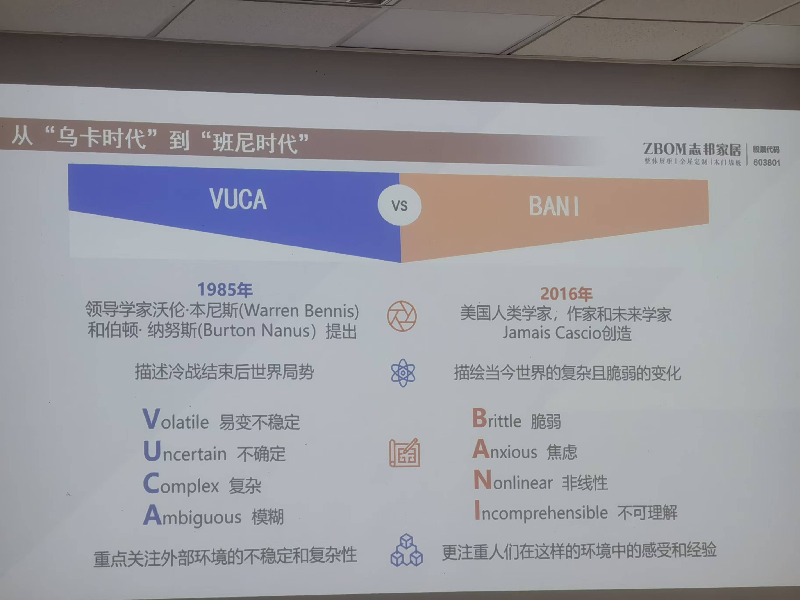

非线性： 更具随机性，不能简单地预测    

## 为啥传统项目管理正在失效？  
“不是你做的不好， 是游戏规则变了”   
.VUCA时代： 世界复杂但可预测 -> 用计划 +  控制应对    
.BANI时代： (r2024-2025现实)：
- 目标本身在漂移（客户说不清要什么）  
- 协作即风险（暴露问题=背锅）
- 小变动引发系统级故障（如AI依赖，政策突变，老师举了特朗普调整政策导致海关系统异常的案例）  
结果：你越“专业”， 越容易成为第一个被牺牲的“责任人”   

## 挑战和应对之策

### 1.目标 
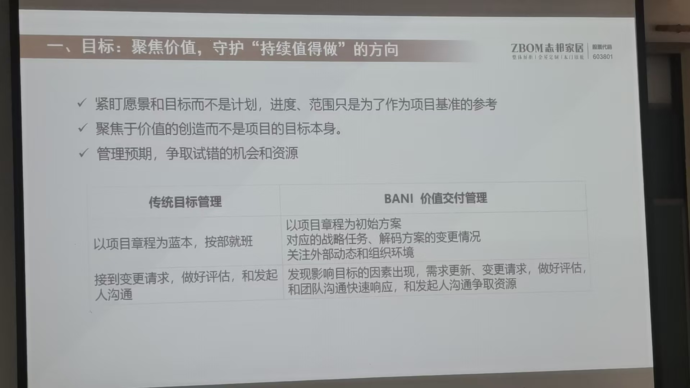

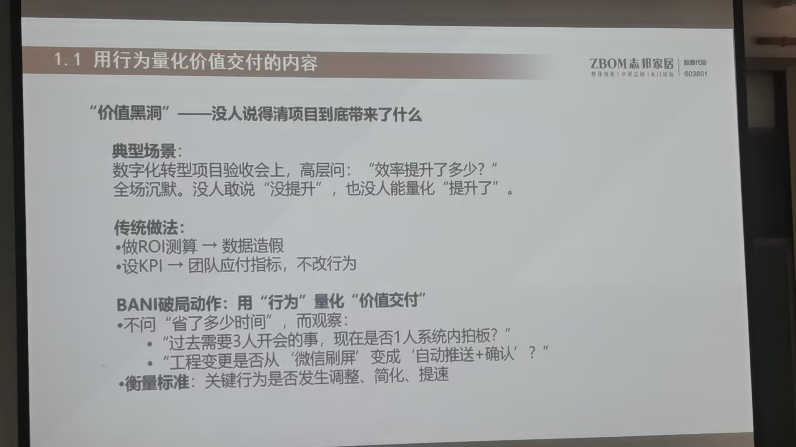

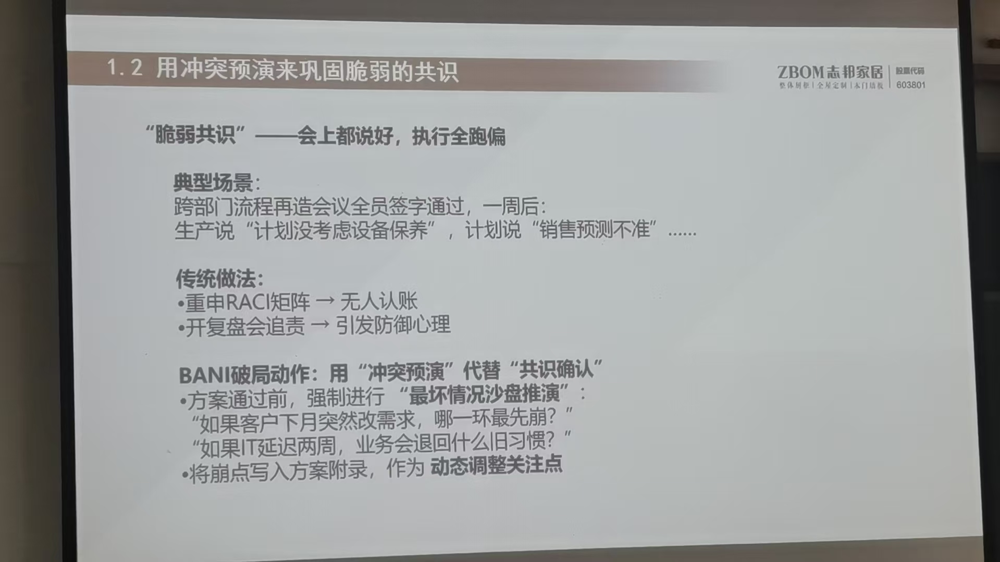

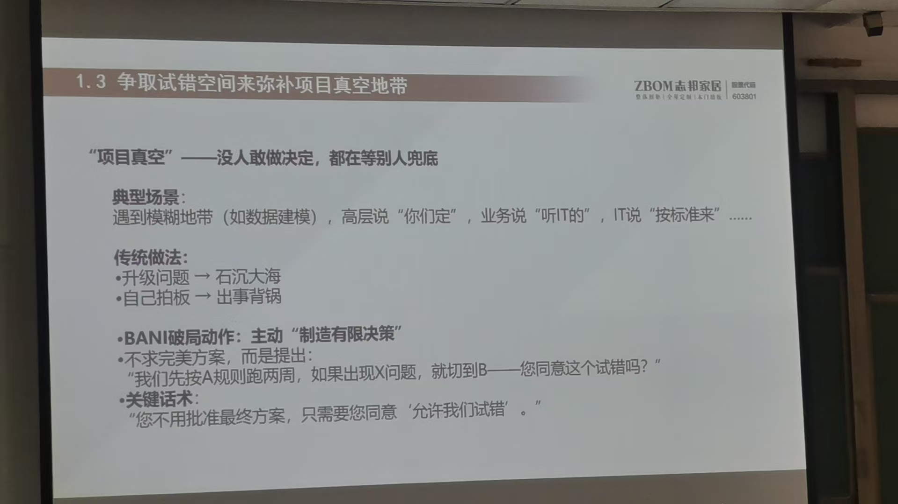

### 2.风险 

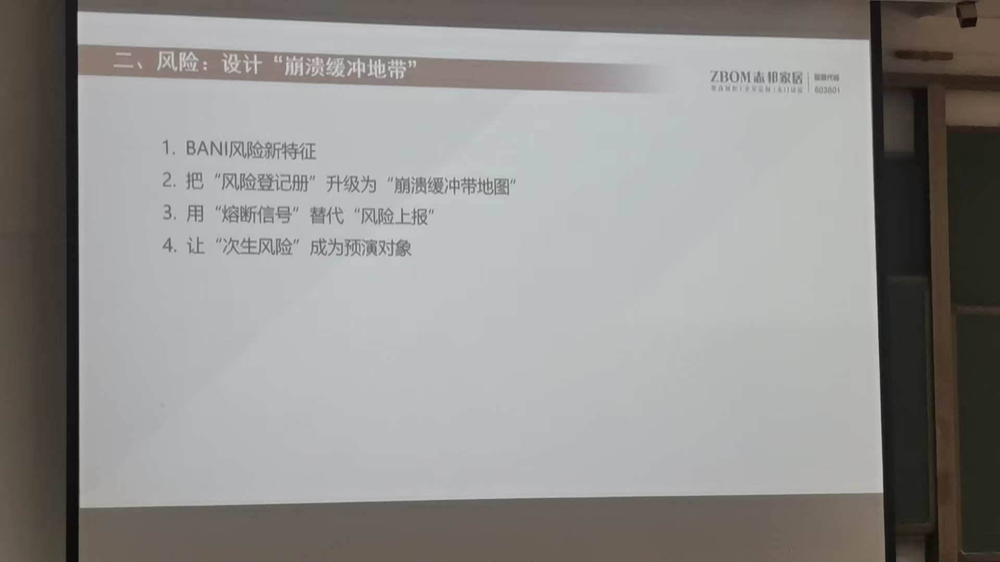

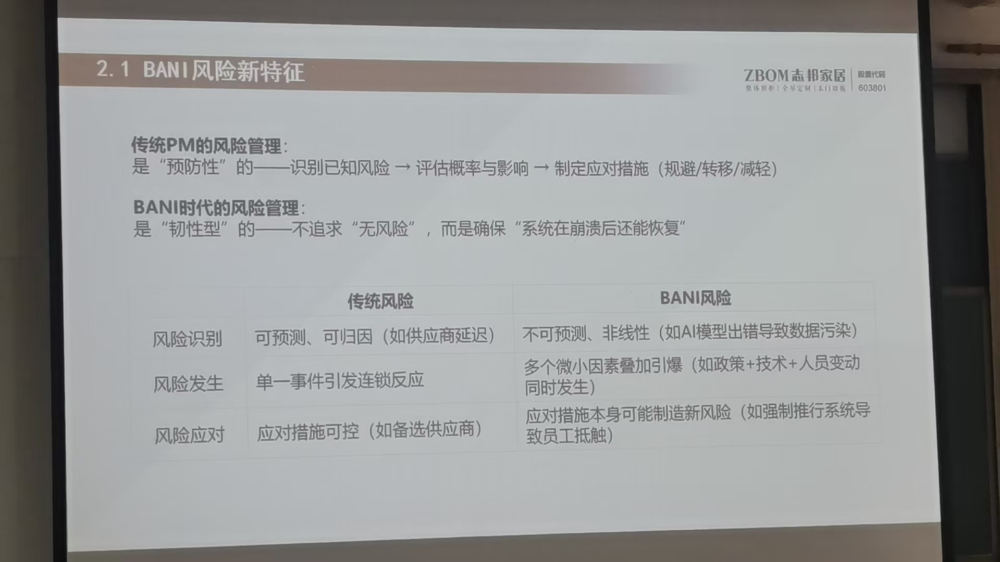

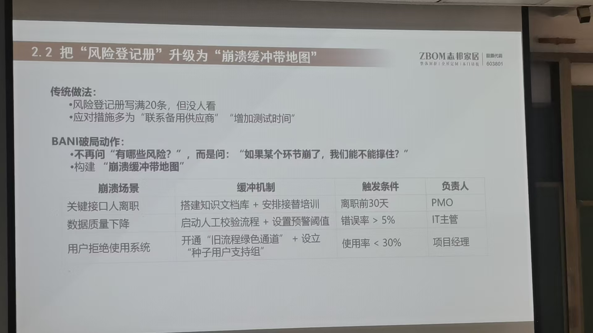

关键：不是防止崩溃，而是让崩溃变成临时可控的

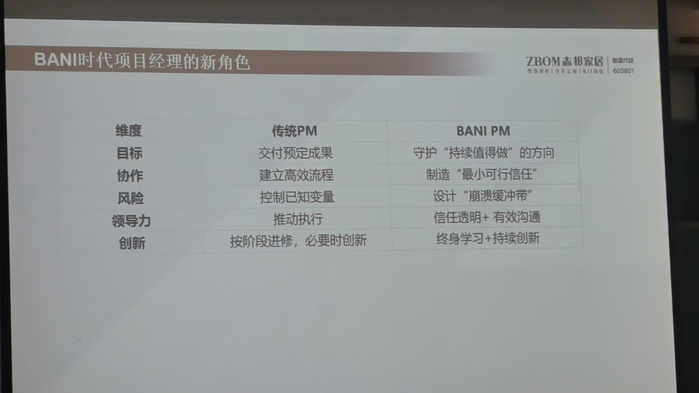

总结：不是不出风险 而是 风险崩溃后还能“站起来”  

### 3.领导力  

论发起人的自我修养 
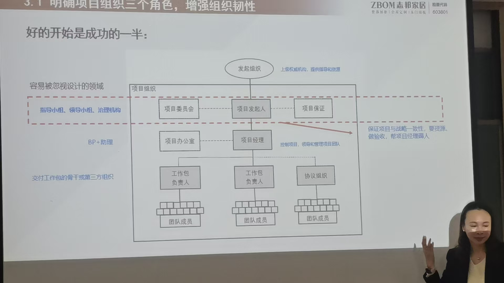

#### 新生代项目成员怎么带？

出现命令不清楚，不问、卡顿 

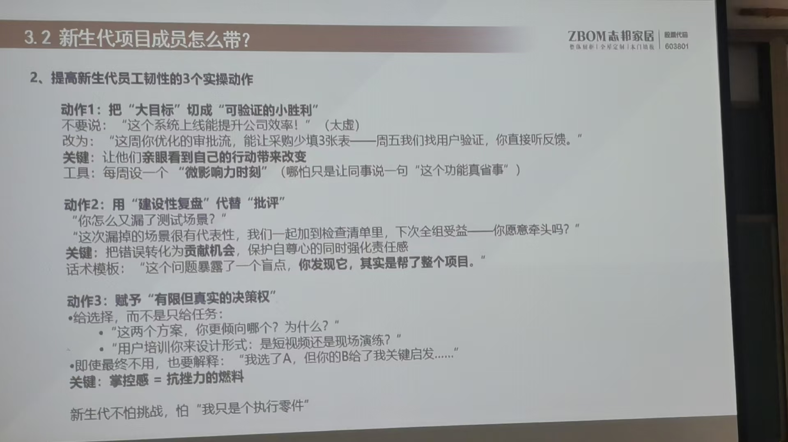

项目团队：若经济价值不到位的时候，情绪价值得多提供   

调心态、搞文化   

### 4.协作 

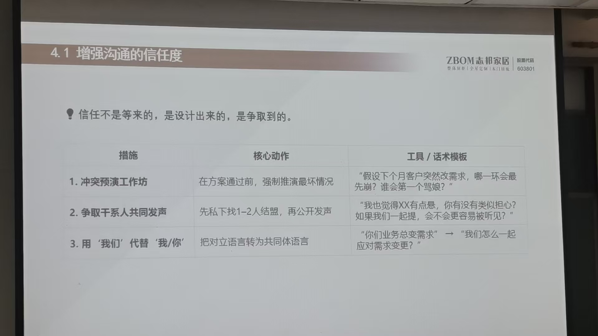

**有效沟通透明度**  
传统沟通是金字塔   ->  去中心化    
项目经理中角色 ,但是降低控制欲   

**有效沟通要点-个人** 
猫头鹰：给足面子，喊“老师”，分配数据组非常好！谨慎型人格，多提感恩。
无相：还有一种变色龙人格，需要变啥就是啥 
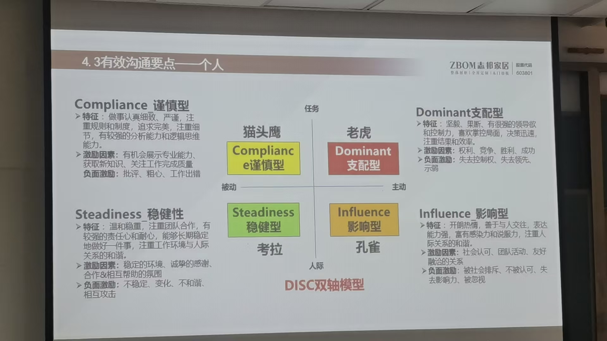

**有效沟通要点-团队**

协作阶段 
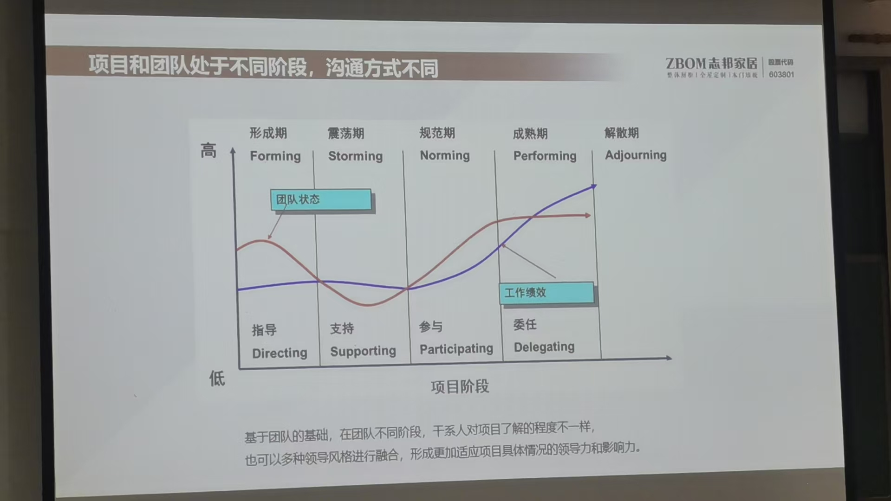

我们现在领导是：信任型，不咋管理  

领导还是需要抗事情的人，跪舔不必要 

### 5.创新  
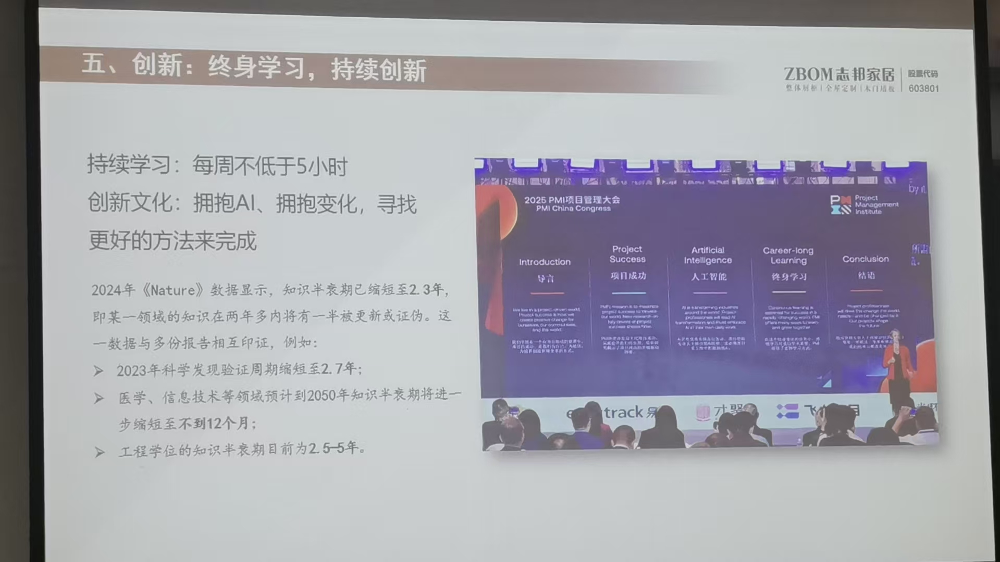

### 6.总结  
用自身 + 团队的任性对应NANI时代的脆弱  
