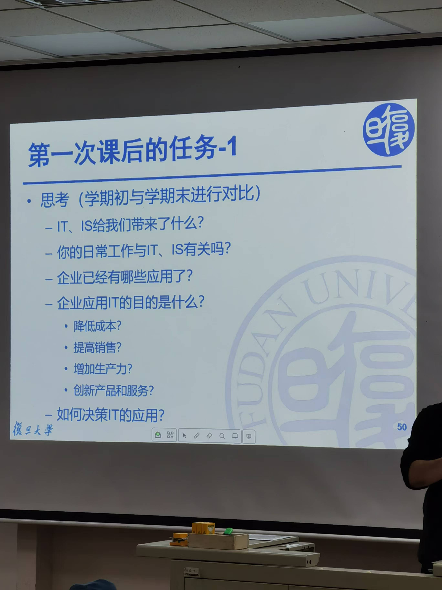
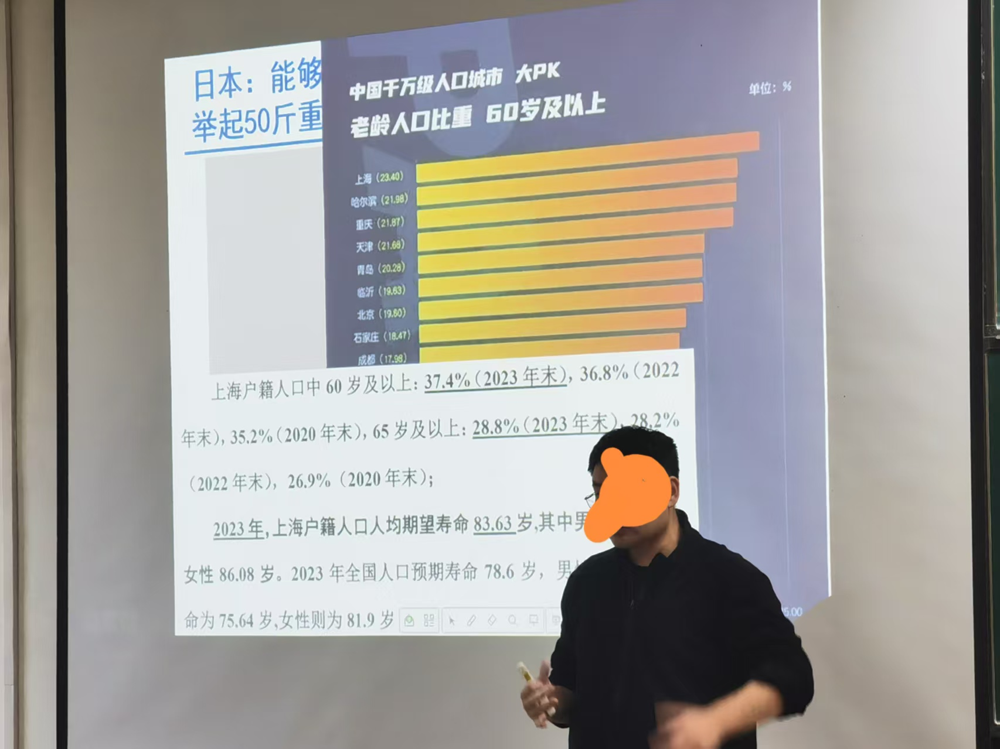

# 课程-管理信息系统 
> 2025年2月16日 第一节课  
>  人工智能时代的企业信息管理  
>  助教： 王梦迪， 24210500029@m.fudan.edu.cn
>  胡安安 huananbeijing@hotmail.com TEL: 65648723  
>  参考书：《管理信息系统》第七版 薛华成(南华,行为学派|北黄,系统学派)； 《管理信息系统》美国出，案例都是最新的   《信息时代的管理信息系统》无电子版      
>  乌托邦数字 数字思维 反脆弱   
>  《第55次中国互联网络发展状态统计报告》 - 需要看，论文研究背景数据来源 等  
>  《控制论与科学方法论》
>   
> 本课能学到
> - 了解管理信息系统体系中基础知识和分析框架： 管理、信息、系统
> - 理解现代信息技术、信息系统能力以及对现代企业产品与服务、管理及其经营模式创新影响
>  
> 要求：  （一周2个H）  
> 到课率和表现 10%   
> 课后作业一次 45%  第三次课程...   考核方式见手机截图     
> 个人期末考试 45%  4月12日考试 特定场景给出自己思考和解决方案  半开卷(一张A4纸张) 20道题    

## 第一次课
老师利用 gpt3.5->4.0 和 DeepSeek 来提供介绍自己文案，从结果来看都不精准。  同时从之前提供的版本也不能算“信息”从而引出管理学如下概念。【居然花了一
个小时-不想给好评】
  
**数据：** 数据是最基础的，它指的是未经处理或解释的事实或细节。数据可以是数字、文字、图像等形式，通常没有明确的意义或上下文。例如，一个温度计显示的“30”这个数字就是数据，
它本身并不能告诉我们太多关于实际情况的信息。  
信息：当数据被赋予了一定的背景或者经过组织、处理后，就变成了信息。信息能够回答诸如谁（Who）、何时（When）、何地（Where）、做了什么（What）等问题，提供了一些意义
和理解的基础。比如，“北京今天的气温是30度”这句话包含了数据，并通过添加位置（北京）和时间（今天）等背景信息，使得这些数据具有了意义，成为了信息。  
**知识：** 知识是在信息的基础上进一步提炼出来的，涉及到理解和应用。知识不仅仅是知道一些事实或者数据，还包括如何使用这些信息来解决问题、做出决策或者创造新价值的能力。例如，
了解到北京夏天的平均气温较高，因此选择合适的穿着或安排户外活动，这就体现了对信息的应用，即知识。
简而言之，数据是原始材料，信息是对数据进行解释后的结果，而知识则是基于信息的理解与应用。三者的关系是一个递进的过程，从数据到信息再到知识，每一步都增加了更多的价值
和理解深度。
**智慧：** 有前于经验的能力且准确  

| **概念**   | **大白话**       |  
|----------|---------------|
| 数据-基础    | 数据就是海边的沙      |
| 信息-判断、决策 | 埋在沙珍珠         |
| 知识-经验、总结 | 历经淘洗反复筛选，制成项链 |
| 智慧-规律、能力 | 精美项链戴在胸前      |

务实的说：项目管理和物流管理过程中，信息的质量是核心【老师讲了一个深刻的例子。某同学于11个最杰出成绩本科毕业生中唯一脱颖而出被某知名企业录取。在简历中： 利用图
表表达了自己绩点上升趋势，同时也清晰表达了：自己学习力。利用好“信息表达力”】   

本课程知识 可以利用到：简历、汇报和页码。 
管理信息系统课程，首先要会确认什么是信息、其次是识别对管理有帮助的信息，最后是从系统角度，借    
老师利用排名前几名上市公司 近些年公司排名变迁趋势，想证明：信息思维、信息系统重要性。

管理是什么？
   - 资源稀缺性决定 | 好钢用在刀刃上   |  技术从来不是稀缺资源，稀缺的是用这些技术创造价值的管理能力
管理工作核心是发现和延续价值，而且要快！
   - 借助信息技术来实现价值，常态化、独特化、柔性
   - 思考今天商业环境：用好、用对、快用
管理信息系统不是过去狭义软件写代码
   - 是超越技术视野、价值发现能力，辩证思考训练。

> 课外话题： 子彬北楼，本来留给校领导，3年没有进去，2016年就改成大数据学院。历史上一直以来都是复旦最牛的院系，以前的复旦数学系在里面。
> 研究生阶段：思考和分析 比 获取知识更重要
> IT可以无处不在，发现和利用IT潜能的洞察力不会平均分布-人工智能同样如此

生产要素是指进行生产经营活动所需要的各种资源和条件，它们是构成生产力的基本因素。传统上，生产要素主要包括以下几类：  
**土地：** 包括所有自然资源，如土壤、矿产、森林、水力等，这些都是生产过程中不可或缺的物质基础。  
**劳动力：** 指人类在生产过程中所投入的体力与脑力劳动。劳动力的质量和数量直接影响到生产的效率和产出水平。  
**资本：** 分为实物资本和金融资本。实物资本包括机器设备、厂房建筑等用于生产的物质资产；金融资本则涉及货币、信贷和其他金融工具，用于支持企业的运营和发展。  
**企业家才能：** 指的是组织并运用上述三种要素进行生产活动的能力。这包括了创新、管理、风险承担等方面的能力。企业家通过识别市场机会、组织生产过程以及
制定商业策略来创造价值。  
随着时代的发展和技术的进步，一些新的要素也被认为是现代生产中不可或缺的部分，例如：  
**技术：** 信息技术、生物技术、自动化技术等高新技术的发展极大地推动了生产力的提升。  
**知识和信息：** 特别是在知识经济时代，知识成为越来越重要的生产要素，对经济增长和社会发展起着关键作用。  
**数据：** 特别是在数字时代，数据作为一种新型资产类别，对于企业决策、产品开发和服务优化变得尤为重要。  

## 第二次课 
如何解读数据
阅读材料：  可接受、理想、线性
摘要，结论，方法过程 -> 样本，场景 -> 贡献  

写论文“套路”    
概率引入(18大)  生成要素地位(19大)  数字中国(20大)   

新质生产力:
0-1: 颠覆性创新
1-100: 可持续发展业态(例，cd蓝光技术，无企业跟进，不可持续)
100-1w: 智慧共赢商业生态系统

### 作业
思考题（不交作业，对比看本节课和学完本门课程的再次理解变化）

### 如何读取数据
该知识点可利用谈判、涨工资等方面
1. 采用逻辑学知识梳理数据（数据本身不会变，要有识别的眼光）
2. 数据就是像捏橡皮泥，看你怎么捏 （例如：采用双栏表，2个倍数不一样的，利用双栏表展示不同倍数，“误导”为同样的提升倍数）

老板想要的人才不可能三角
忠诚度高  能力强  价格低

## 第三次课
### 重新认识人工智能时代  

下周(第四周)有作业， 下载eLearning  
解读数据结果-为啥吃“安慰剂”为啥有效？  
1. 自愈
2. 心理作用
3. 水(仪式感，也可以归集到心理作用)

人类会被AI替代吗？       
16年围棋  (枚举值: 19*19行列，然后，每种有3种可能性(10的180次)；人类的粒子才:10的10次方，宇宙粒子才10的80次)  
19年德州扑克被攻克   
电子竞技AI也能打败人   

### 人工智能三大流派     
人工智能领域的三大主要流派或方法论分别是：符号主义（Symbolicism）、连接主义（Connectionism）和行为主义（Actionism）。每个流派都有其独特的理论基础、研究方法和技术应用。

**符号主义（Symbolicism）：**          
符号主义，也被称为基于规则的人工智能，它认为人类的认知过程可以通过符号操作来模拟。这种方法依赖于建立一套明确的逻辑规则和知识表示系统来解决问题。
典型技术包括专家系统、知识图谱等。早期的人工智能研究很多都是基于符号主义的方法进行的。     
**连接主义（Connectionism）：**            
连接主义强调模仿人脑的工作方式，尤其是通过模拟神经元网络来进行学习和信息处理。这种方法下的人工智能系统通常由大量的简单处理单元（即“神经元”）组成，这些单元通过权重相互连接，并能够根据经验调整权重以改进性能。
深度学习是当前连接主义的一个重要体现，它利用多层神经网络结构解决复杂的模式识别问题，如图像识别、语音识别等。     
**行为主义（Actionism）：**            
行为主义关注的是如何让机器在与环境互动中学习适应和解决问题的能力。这种方法注重对外部刺激的反应以及如何通过一系列的动作来实现目标。
机器人技术和强化学习是行为主义的典型应用。例如，AlphaGo就是使用了强化学习算法，通过自我对弈不断优化策略。
这三个流派各有侧重，但近年来的发展趋势显示它们之间存在融合的趋势，比如现代深度学习模型可能会结合符号处理能力以增强解释性和推理能力。这种跨流派的合作有助于推动人工智能技术向更加通用和强大的方向发展。

### AI硬件支撑
量子计算机   

**量子计算中的叠加态**是量子力学中一个非常重要的概念，它允许量子比特（qubit）同时处于多个状态的组合之中。在经典计算中，比特只能是0或1，但在量子计算中，
由于叠加原理，一个量子比特可以同时是0和1的任意叠加。

**叠加态的基本概念**     
量子比特（Qubit）：与经典计算机中的比特不同，量子比特不仅可以处于|0⟩和|1⟩这两个基本状态之一，还可以处于它们的任何线性组合，即叠加态α|0⟩ + β|1⟩。
这里，α和β是复数，满足|α|^2 + |β|^2 = 1，这表示测量时得到相应结果的概率。
叠加态：当一个量子系统处于叠加态时，意味着它同时存在于多种可能的状态中。例如，单个量子比特可以处于|0⟩和|1⟩的叠加态(1/√2)(|0⟩ + |1⟩)，这意味着当
我们测量这个量子比特时，有50%的概率发现它是|0⟩状态，也有50%的概率发现它是|1⟩状态。   

**叠加态的应用**       
量子并行性：量子计算的一个关键优势在于其能够利用叠加态实现量子并行处理。例如，在搜索算法或因子分解算法中，通过将量子比特置于适当的叠加态，可以在同一时间对大量数据进行操作，从而大大提高了计算效率。    
量子态制备：在执行量子计算之前，通常需要将量子系统初始化到特定的叠加态上。这可以通过各种量子门操作来完成，比如Hadamard门可以将一个确定的量子比特状态转换为均匀叠加态。   
量子纠缠与叠加态：量子叠加与量子纠缠密切相关，后者是指两个或更多的粒子可以以一种方式相互关联，以至于一个粒子的状态会立即影响另一个粒子的状态，无论它们相距多远。这种现象在叠加态的基础上进一步增强了量子计算的能力。    
量子叠加态不仅是量子计算的基础，也是其他量子技术如量子通信、量子模拟等领域的核心。通过巧妙地操纵这些叠加态，科学家们正在开辟一条通往新一代信息技术的道路。  

## 第四次课
管理信息系   
1、案例作业(第七次上课前) 占比成绩的 45%;   
已经上传 eLearning，第七次前发到助教邮箱。      

2、新词   
瞪羚企业：https://baijiahao.baidu.com/s?id=1825764190708779349&wfr=spider&for=pc      
独角兽： 成立10年内，估值10亿上   
具身智能：https://baike.baidu.com/item/%E5%85%B7%E8%BA%AB%E6%99%BA%E8%83%BD/63286570 
投资于人：目的培养瞪羚企业      

3、新应用  
manus，可以利用该工具写“材料”         

上海老人比例：

