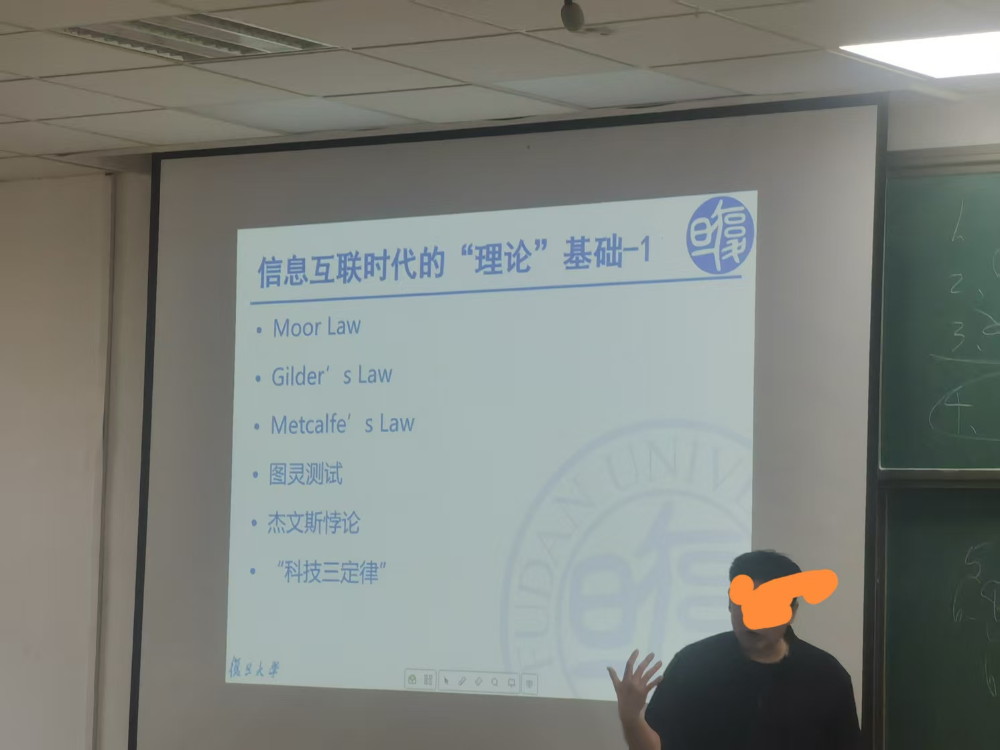

# 课程-管理信息系统 
> 2025年2月16日 第一节课  
>  人工智能时代的企业信息管理  
>  助教： 王梦迪， 24210500029@m.fudan.edu.cn
>  胡安安 huananbeijing@hotmail.com TEL: 65648723  
>  参考书：《管理信息系统》第七版 薛华成(南华,行为学派|北黄,系统学派)； 《管理信息系统》美国出，案例都是最新的   《信息时代的管理信息系统》无电子版      
>  乌托邦数字 数字思维 反脆弱   
>  《第55次中国互联网络发展状态统计报告》 - 需要看，论文研究背景数据来源 等  
>  《控制论与科学方法论》
>   
> 本课能学到
> - 了解管理信息系统体系中基础知识和分析框架： 管理、信息、系统
> - 理解现代信息技术、信息系统能力以及对现代企业产品与服务、管理及其经营模式创新影响
>  
> 要求：  （一周2个H）  
> 到课率和表现 10%   
> 课后作业一次 45%  第三次课程...   考核方式见手机截图     
> 个人期末考试 45%  4月12日考试 特定场景给出自己思考和解决方案  半开卷(一张A4纸张) 20道题    

## 第一次课
老师利用 gpt3.5->4.0 和 DeepSeek 来提供介绍自己文案，从结果来看都不精准。  同时从之前提供的版本也不能算“信息”从而引出管理学如下概念。【居然花了一
个小时-不想给好评】
  
**数据：** 数据是最基础的，它指的是未经处理或解释的事实或细节。数据可以是数字、文字、图像等形式，通常没有明确的意义或上下文。例如，一个温度计显示的“30”这个数字就是数据，
它本身并不能告诉我们太多关于实际情况的信息。  
信息：当数据被赋予了一定的背景或者经过组织、处理后，就变成了信息。信息能够回答诸如谁（Who）、何时（When）、何地（Where）、做了什么（What）等问题，提供了一些意义
和理解的基础。比如，“北京今天的气温是30度”这句话包含了数据，并通过添加位置（北京）和时间（今天）等背景信息，使得这些数据具有了意义，成为了信息。  
**知识：** 知识是在信息的基础上进一步提炼出来的，涉及到理解和应用。知识不仅仅是知道一些事实或者数据，还包括如何使用这些信息来解决问题、做出决策或者创造新价值的能力。例如，
了解到北京夏天的平均气温较高，因此选择合适的穿着或安排户外活动，这就体现了对信息的应用，即知识。
简而言之，数据是原始材料，信息是对数据进行解释后的结果，而知识则是基于信息的理解与应用。三者的关系是一个递进的过程，从数据到信息再到知识，每一步都增加了更多的价值
和理解深度。
**智慧：** 有前于经验的能力且准确  

| **概念**   | **大白话**       |  
|----------|---------------|
| 数据-基础    | 数据就是海边的沙      |
| 信息-判断、决策 | 埋在沙珍珠         |
| 知识-经验、总结 | 历经淘洗反复筛选，制成项链 |
| 智慧-规律、能力 | 精美项链戴在胸前      |

务实的说：项目管理和物流管理过程中，信息的质量是核心【老师讲了一个深刻的例子。某同学于11个最杰出成绩本科毕业生中唯一脱颖而出被某知名企业录取。在简历中： 利用图
表表达了自己绩点上升趋势，同时也清晰表达了：自己学习力。利用好“信息表达力”】   

本课程知识 可以利用到：简历、汇报和页码。 
管理信息系统课程，首先要会确认什么是信息、其次是识别对管理有帮助的信息，最后是从系统角度，借    
老师利用排名前几名上市公司 近些年公司排名变迁趋势，想证明：信息思维、信息系统重要性。

管理是什么？
   - 资源稀缺性决定 | 好钢用在刀刃上   |  技术从来不是稀缺资源，稀缺的是用这些技术创造价值的管理能力
管理工作核心是发现和延续价值，而且要快！
   - 借助信息技术来实现价值，常态化、独特化、柔性
   - 思考今天商业环境：用好、用对、快用
管理信息系统不是过去狭义软件写代码
   - 是超越技术视野、价值发现能力，辩证思考训练。

> 课外话题： 子彬北楼，本来留给校领导，3年没有进去，2016年就改成大数据学院。历史上一直以来都是复旦最牛的院系，以前的复旦数学系在里面。
> 研究生阶段：思考和分析 比 获取知识更重要
> IT可以无处不在，发现和利用IT潜能的洞察力不会平均分布-人工智能同样如此

生产要素是指进行生产经营活动所需要的各种资源和条件，它们是构成生产力的基本因素。传统上，生产要素主要包括以下几类：  
**土地：** 包括所有自然资源，如土壤、矿产、森林、水力等，这些都是生产过程中不可或缺的物质基础。  
**劳动力：** 指人类在生产过程中所投入的体力与脑力劳动。劳动力的质量和数量直接影响到生产的效率和产出水平。  
**资本：** 分为实物资本和金融资本。实物资本包括机器设备、厂房建筑等用于生产的物质资产；金融资本则涉及货币、信贷和其他金融工具，用于支持企业的运营和发展。  
**企业家才能：** 指的是组织并运用上述三种要素进行生产活动的能力。这包括了创新、管理、风险承担等方面的能力。企业家通过识别市场机会、组织生产过程以及
制定商业策略来创造价值。  
随着时代的发展和技术的进步，一些新的要素也被认为是现代生产中不可或缺的部分，例如：  
**技术：** 信息技术、生物技术、自动化技术等高新技术的发展极大地推动了生产力的提升。  
**知识和信息：** 特别是在知识经济时代，知识成为越来越重要的生产要素，对经济增长和社会发展起着关键作用。  
**数据：** 特别是在数字时代，数据作为一种新型资产类别，对于企业决策、产品开发和服务优化变得尤为重要。  

## 第二次课 
如何解读数据
阅读材料：  可接受、理想、线性
摘要，结论，方法过程 -> 样本，场景 -> 贡献  

写论文“套路”    
概率引入(18大)  生成要素地位(19大)  数字中国(20大)   

新质生产力:
0-1: 颠覆性创新
1-100: 可持续发展业态(例，cd蓝光技术，无企业跟进，不可持续)
100-1w: 智慧共赢商业生态系统

### 作业
思考题（不交作业，对比看本节课和学完本门课程的再次理解变化）   

### 如何读取数据
该知识点可利用谈判、涨工资等方面
1. 采用逻辑学知识梳理数据（数据本身不会变，要有识别的眼光）
2. 数据就是像捏橡皮泥，看你怎么捏 （例如：采用双栏表，2个倍数不一样的，利用双栏表展示不同倍数，“误导”为同样的提升倍数）

老板想要的人才不可能三角
忠诚度高  能力强  价格低

## 第三次课
### 重新认识人工智能时代  

下周(第四周)有作业， 下载eLearning  
解读数据结果-为啥吃“安慰剂”为啥有效？  
1. 自愈
2. 心理作用
3. 水(仪式感，也可以归集到心理作用)

人类会被AI替代吗？       
16年围棋  (枚举值: 19*19行列，然后，每种有3种可能性(10的180次)；人类的粒子才:10的10次方，宇宙粒子才10的80次)  
19年德州扑克被攻克   
电子竞技AI也能打败人   

### 人工智能三大流派     
人工智能领域的三大主要流派或方法论分别是：符号主义（Symbolicism）、连接主义（Connectionism）和行为主义（Actionism）。每个流派都有其独特的理论基础、研究方法和技术应用。

**符号主义（Symbolicism）：**          
符号主义，也被称为基于规则的人工智能，它认为人类的认知过程可以通过符号操作来模拟。这种方法依赖于建立一套明确的逻辑规则和知识表示系统来解决问题。
典型技术包括专家系统、知识图谱等。早期的人工智能研究很多都是基于符号主义的方法进行的。     
**连接主义（Connectionism）：**            
连接主义强调模仿人脑的工作方式，尤其是通过模拟神经元网络来进行学习和信息处理。这种方法下的人工智能系统通常由大量的简单处理单元（即“神经元”）组成，这些单元通过权重相互连接，并能够根据经验调整权重以改进性能。
深度学习是当前连接主义的一个重要体现，它利用多层神经网络结构解决复杂的模式识别问题，如图像识别、语音识别等。     
**行为主义（Actionism）：**            
行为主义关注的是如何让机器在与环境互动中学习适应和解决问题的能力。这种方法注重对外部刺激的反应以及如何通过一系列的动作来实现目标。
机器人技术和强化学习是行为主义的典型应用。例如，AlphaGo就是使用了强化学习算法，通过自我对弈不断优化策略。
这三个流派各有侧重，但近年来的发展趋势显示它们之间存在融合的趋势，比如现代深度学习模型可能会结合符号处理能力以增强解释性和推理能力。这种跨流派的合作有助于推动人工智能技术向更加通用和强大的方向发展。

### AI硬件支撑
量子计算机   

**量子计算中的叠加态**是量子力学中一个非常重要的概念，它允许量子比特（qubit）同时处于多个状态的组合之中。在经典计算中，比特只能是0或1，但在量子计算中，
由于叠加原理，一个量子比特可以同时是0和1的任意叠加。

**叠加态的基本概念**     
量子比特（Qubit）：与经典计算机中的比特不同，量子比特不仅可以处于|0⟩和|1⟩这两个基本状态之一，还可以处于它们的任何线性组合，即叠加态α|0⟩ + β|1⟩。
这里，α和β是复数，满足|α|^2 + |β|^2 = 1，这表示测量时得到相应结果的概率。
叠加态：当一个量子系统处于叠加态时，意味着它同时存在于多种可能的状态中。例如，单个量子比特可以处于|0⟩和|1⟩的叠加态(1/√2)(|0⟩ + |1⟩)，这意味着当
我们测量这个量子比特时，有50%的概率发现它是|0⟩状态，也有50%的概率发现它是|1⟩状态。   

**叠加态的应用**       
量子并行性：量子计算的一个关键优势在于其能够利用叠加态实现量子并行处理。例如，在搜索算法或因子分解算法中，通过将量子比特置于适当的叠加态，可以在同一时间对大量数据进行操作，从而大大提高了计算效率。    
量子态制备：在执行量子计算之前，通常需要将量子系统初始化到特定的叠加态上。这可以通过各种量子门操作来完成，比如Hadamard门可以将一个确定的量子比特状态转换为均匀叠加态。   
量子纠缠与叠加态：量子叠加与量子纠缠密切相关，后者是指两个或更多的粒子可以以一种方式相互关联，以至于一个粒子的状态会立即影响另一个粒子的状态，无论它们相距多远。这种现象在叠加态的基础上进一步增强了量子计算的能力。    
量子叠加态不仅是量子计算的基础，也是其他量子技术如量子通信、量子模拟等领域的核心。通过巧妙地操纵这些叠加态，科学家们正在开辟一条通往新一代信息技术的道路。  

## 第四次课
管理信息系   
1、案例作业(第七次上课前) 占比成绩的 45%;   
已经上传 eLearning，第七次前发到助教邮箱。      

2、新词   
瞪羚企业：  
https://baijiahao.baidu.com/s?id=1825764190708779349&wfr=spider&for=pc    

独角兽： 成立10年内，估值10亿上   

具身智能：   
https://baike.baidu.com/item/%E5%85%B7%E8%BA%AB%E6%99%BA%E8%83%BD/63286570   
投资于人：目的培养瞪羚企业      

3、新应用  
manus，可以利用该工具写“材料”         

上海老人比例：  

4、变革   
技术：决定变革
技术是推动社会进步的关键动力。每一次重大的技术突破，如互联网、人工智能、区块链等，都会引发一系列的社会与经济结构变化。技术不仅改变了我们生活和工作的方
式，也促使企业和个人不断适应新的工具和方法来提高效率和创新能力。   

商业模式：苹果公司的案例   
苹果公司是一个典型的例子，展示了如何通过独特的商业模式超越单纯的技术优势。尽管苹果的许多技术创新可以被竞争对手复制，但其构建的强大生态系统——包括App S
tore、iTunes、iCloud等服务——为用户提供了无可比拟的价值体验。此外，苹果还通过设计美学、用户体验优化以及品牌忠诚度的培养，在市场上建立了难以逾越的竞
争壁垒。   

工业：突破式创新  
在工业领域，突破性创新往往指的是那些能够显著改变生产方式或产品性能的技术革新。例如，3D打印技术正在重塑制造业，使得定制化生产和快速原型制作成为可能；而
工业4.0概念则强调利用物联网、大数据分析等先进技术实现智能制造，进一步提升生产力和灵活性。   

社会：适应与转型  
社会层面的变化主要体现在人们对于新技术及其带来的生活方式转变的态度上。随着科技的发展，社会需要不断地调整法律框架、教育体系和社会规范以适应这些变化。同
时，公众意识也在逐渐向可持续发展、隐私保护等方面倾斜，这要求政策制定者和技术开发者更加注重伦理考量和社会责任。此外，数字鸿沟问题也日益凸显，确保所有人
都能平等地享受到科技进步带来的好处成为一个重要的挑战。  

**个体的报酬不是和个体劳动成正比，而是和劳动的创新性、不可替代性成正比--适应、融合、创新。**      
**发现问题、解决问题--和是否是教授、院士无关**  

5、互联网常见定律  

- 摩尔定律： 
- 吉尔德定律：是关于网络带宽增长的一个观察，它指出最大通信网络的带宽将以每年三倍于摩尔定律预测的计算机性能增长速度的速度增长。具体来说，吉尔德定律提出
最大通信网络的带宽每8个月翻一番。这一规律由科技分析师和作家乔治·吉尔德（George Gilder）提出。乔治.吉尔德提出
- 迈特卡尔夫定律： 网络价值同网络用户数量的平方成正比，即N个连接可以创造N*N的效益，正比是企业盈利能力。

## 第五次课程
> 2025年3月16日

互联网常见定律  
- 杰文斯悖论: 杰文斯悖论是由19世纪英国经济学家威廉·斯坦利·杰文斯提出的一个经济学理论，它描述了提高资源使用效率（例如通过技术进步）可能导致该资源消耗
量增加而非减少的现象。这个悖论最初是为了解释煤炭在工业革命期间的使用情况：尽管蒸汽机的效率得到了显著提升，但煤炭的总体消费量反而增加了。

杰文斯悖论的核心观点:  
效率提升：当一种资源的使用效率得到提高时，意味着每单位资源可以产生更多的产出。  
成本下降：随着效率的提高，通常这种资源的相对成本会降低，使得它在经济活动中更加具有吸引力。  
需求增加：由于成本下降和效率提升，更多的企业和个人倾向于使用这种资源，最终导致其总消耗量上升。  
现代应用与例子   
在现代社会中，杰文斯悖论可以应用于多个领域，包括能源使用、交通以及信息技术等。例如：  
汽车燃油效率：如果汽车燃油效率大幅提高，理论上减少了每次行驶所需的燃料量。然而，这可能促使人们驾驶更多或购买更大的车辆，结果整体燃油消耗可能不降反升。  
数据中心能耗：尽管计算硬件变得更加节能，但全球数据存储和处理需求的增长速度超过了能效改进的速度，导致数据中心总能耗持续增长。  
应对策略  
针对杰文斯悖论带来的挑战，政策制定者和企业可以采取多种措施来缓解资源消耗的增长趋势，如：
实施总量控制：通过对特定资源设定上限，确保即使效率提高也不会导致总消耗量无限制增长。  
推动替代技术和行为改变：鼓励开发和采用可再生资源和其他环保技术，并倡导节约资源的行为模式。  
税收和补贴政策：利用税收或其他财政工具调节资源使用的成本，以引导市场向更可持续的方向发展。  
理解杰文斯悖论有助于更好地设计政策和技术解决方案，从而在提高资源使用效率的同时实现环境保护的目标。  

- 科技三定律: 是指由著名科幻作家艾萨克·阿西莫夫（Isaac Asimov）在其机器人系列小说中提出的“机器人三定律”。不过，也有其他领域如技术发展和社会影响
方面的定律或原则被广泛讨论。如果这里特指阿西莫夫的贡献，则内容如下：  
机器人三定律  
1. 第一定律：机器人不得伤害人类个体，或因不作为使人类个体受到伤害。  
2. 第二定律：机器人必须遵循人类的命令，除非这些命令与第一定律相抵触。  
3. 第三定律：在不违背第一及第二定律的前提下，机器人必须保护自己。  
这些定律最初出现在阿西莫夫的短篇小说《环舞》(Runaround, 1942) 中，并成为了他之后许多作品的基础。它们探讨了当机器人变得足够智能和自主时可能出现的
问题以及如何通过编程规则来避免这些问题。  
然而，如果您的意思是关于技术发展的某些普遍原理或趋势的“科技三定律”，那么可能是以下几种之一，尽管没有一个正式定义的“科技三定律”列表：  
摩尔定律：集成电路中的晶体管数量大约每两年翻一番，同时价格下降一半。这一定律预测了计算能力的增长速率及其成本效益。  
梅特卡夫定律：网络的价值与联网用户数的平方成正比。它强调了网络效应的重要性，尤其是在信息技术和互联网领域。  
吉尔德定律：又称胜利者浪费定律，指出未来宽带的增长速度将超过需求增长的速度，允许一定程度上的“浪费”。   
请注意，根据上下文，“科技三定律”可能指向不同的概念。如果您指的是另一组特定的技术或科学定律，请提供更多的背景信息以便给出准确的回答。如果是关于阿西莫夫
的机器人三定律，上述即为详细解释。

## 第六次课程
> 2025年3月23日，下周3月30日是最后一次课程。  
> 2025年4月12日考试， 半开卷(只能一张A4纸)，下次课程将在8:30之后讲重点(考试)内容              
> 案例小组作业，3.30日之前发给助教；否则成绩不算通过；占比50%         

复旦国际学生和教师；国内排行第二  

最终存活的，既不是最强壮的(恐龙等)，也不是最聪明的(很多方面动物的杰作是比人类强大很多)，而是对那些对变化反应最快的         
竞争的胜利不是看当前适应(主观因素)，而是看能否获得超出其他物种的进化能力(客观因素)，竞争胜利者是那些获得超出其他物种进化能力的生物(企业也是如此)     
物种的进化是相互制约的，物种都在进化，从短期来看，只要跟上就能生存下去，但从长远来看，一个物种要在生态系统中获得有利地位，就要比别的物种跑的更快  

“一流公司做标准，二流企业做品牌，三流企业做产品”是商业领域的经典说法，揭示了不同层次企业的核心竞争力和发展策略。具体来说：
### 1. **一流公司做标准**
- **定义行业规则**：一流企业通过技术创新和行业影响力，制定行业标准，掌握话语权。
- **竞争优势**：成为标准制定者意味着在市场中占据主导地位，其他企业需遵循其规则。
- **案例**：如英特尔在处理器领域、高通在通信技术领域。

### 2. **二流企业做品牌**
- **品牌建设**：二流企业通过强大的品牌影响力和市场营销，赢得消费者信任。
- **差异化竞争**：通过品牌塑造，形成差异化优势，提升市场竞争力。
- **案例**：如耐克、可口可乐等，通过品牌价值赢得市场。

### 3. **三流企业做产品**
- **产品为核心**：三流企业专注于产品的生产与销售，依赖性价比或功能吸引消费者。
- **价格竞争**：通常面临激烈的价格战，利润空间有限。
- **案例**：许多中小制造企业，依赖低成本和大规模生产。

### 4. **四流企业做服务**
- **服务为核心**：四流企业通过提供优质服务赢得客户，尤其在产品同质化严重的行业。
- **客户关系**：通过服务提升客户满意度和忠诚度。
- **案例**：如一些本地化服务企业，依赖服务质量竞争。

### 5. **五流企业做模仿**
- **模仿策略**：五流企业缺乏创新能力，主要通过模仿成功企业的产品或模式进入市场。
- **低成本竞争**：依赖低成本生产和低价策略，但难以形成长期竞争力。
- **案例**：一些山寨产品制造商。

### 总结
- **一流企业**：制定标准，掌握行业话语权。
- **二流企业**：打造品牌，形成差异化优势。
- **三流企业**：专注产品，依赖性价比竞争。
- **四流企业**：提供服务，通过服务赢得客户。
- **五流企业**：模仿他人，依赖低成本竞争。

企业应根据自身资源和能力，选择合适的发展策略，逐步提升竞争力。    

### 管理信息系统定义
管理信息系统（Management Information System，简称MIS） 是一种集成化的计算机系统，旨在收集、处理、存储和传递信息，以支持组织的管理决策和运营活
动。它结合了信息技术、管理学和系统理论，帮助组织更高效地管理和利用信息资源。

管理信息系统的核心定义：
信息收集与处理：MIS 通过内部和外部数据源收集信息，并将其转化为有用的形式。

决策支持：为管理层提供及时、准确的信息，帮助其制定战略和运营决策。

系统化与集成化：MIS 是一个综合系统，整合了硬件、软件、数据、流程和人员，确保信息流的顺畅。

目标导向：MIS 的最终目标是提高组织的效率、竞争力和决策质量。

## 第七次课程
> 2025年3月30日

详细见第七次课程PPT文档

