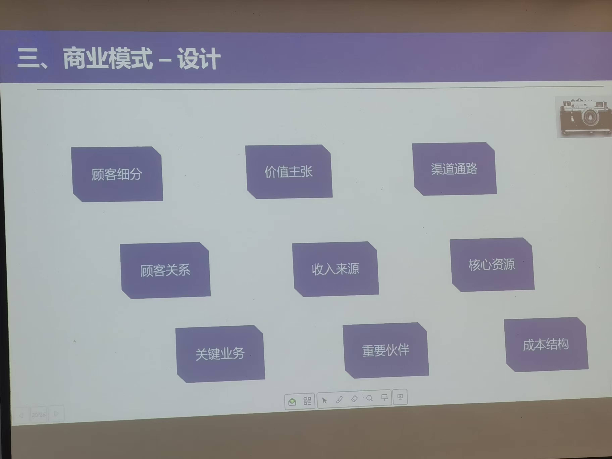

# 课程-创新创业
> 2025年11月9日 第一节课    
>  创新创业  
>  助教： 无
>  老师： 
>
> 
> 
>
> 要求：    

## 第一次课
2025年11月9日   

创业者应该具备精神    
1. 责任感，创业是为了赚钱、但是创业不仅仅为了赚钱。创业者需自己

不用花太多时间、

养老   
目前没有的资源需要怎么样开发获取资源   

## 第三节课
2025年11月23日  
**市场调研的步骤**   
指定调研方案  
根据方案做有效的数据采集和信息收集   
数据的分析与论证   
形成初步调研报告   
交流、反馈、纠偏  
形成最终市场调研报告   

**市场调用调控**
1、时间调控   
3-1年 具体再看  

2、调用费用调控

### 创新公司最容易忽视的问题-竞争者  
1、谁会是你的竞争者？    
  同类产品/服务,不同类产品/服务  

采用SWOT分析法分析你的竞争对手、分析结果可以作为企业的战略决策向导     
strength(优势-加分项)    
opportunity(机会加分项)         
weakness(劣势-内部)     
threat(威胁-外部)      

初创企业在做市场调研是

2、怎么把自己优势劣势和竞争者比较，能否找到突破口  
  市场上已有了强有力的竞争者，不代表你没有机会，机会需要自己去寻找和创造。（例如：拼多多）   

## 第N节课
2025年12月7日  

### 如何写商业计划书  

**商业计划包含的核心要素**    
1. 为什么这是一个有价值的创业机会?
2. 新产品或者服务要卖给谁?顾客是谁?
3. 如何开发、生产、销售新产品或者服务?
4. 目前和未来的创业环境如何?如何面对竞争?
5. 创业者是谁?是否拥有足够的技能、经验和知识储备和资源等
6. 财务规划、未来融资意向等。

**商业模式-设计**   

**商业计划书**   
1. 执行摘要
2. 愿景、使命与核心价值观
3. 新创意及产品/服务形成的背景和预期目标方
4. 市场营销分析(合理分析，证据充足)A
5. 竞品分析(如果竞争者较多，可以将竞争者归类分析)5.
6. 开发、生产和选址(注意把控时间节点和资金的使用，选址依据)
7. 创业团队
8. 财务预测和分析
9. 风险和挑战
10. 时间计划(短期规划和长期规划)

**注意点**   
做好自己     
要清楚的显示出自己与竞争对手的差异    
明确目标市场，提供顾客真实存在的证据    
陈述事实，避免“估计”“猜测”等主观判断    
给你的商业计划起一个响亮贴切的名字    
整洁大方的排版格式，不要有错别字    
篇幅 一般10-20页，简洁尽量避免用专业术语    

**答辩环节**   
听懂提问者的问题，切不可不懂装懂，答非所问   
当提问者问到和ppt展示相关的问题时，要迅速翻到相关页面    
若是投资人的问题，建议可以和投资人互动，了解投资人的需求   
正确对待所有人对项目和路演提出的批评   

