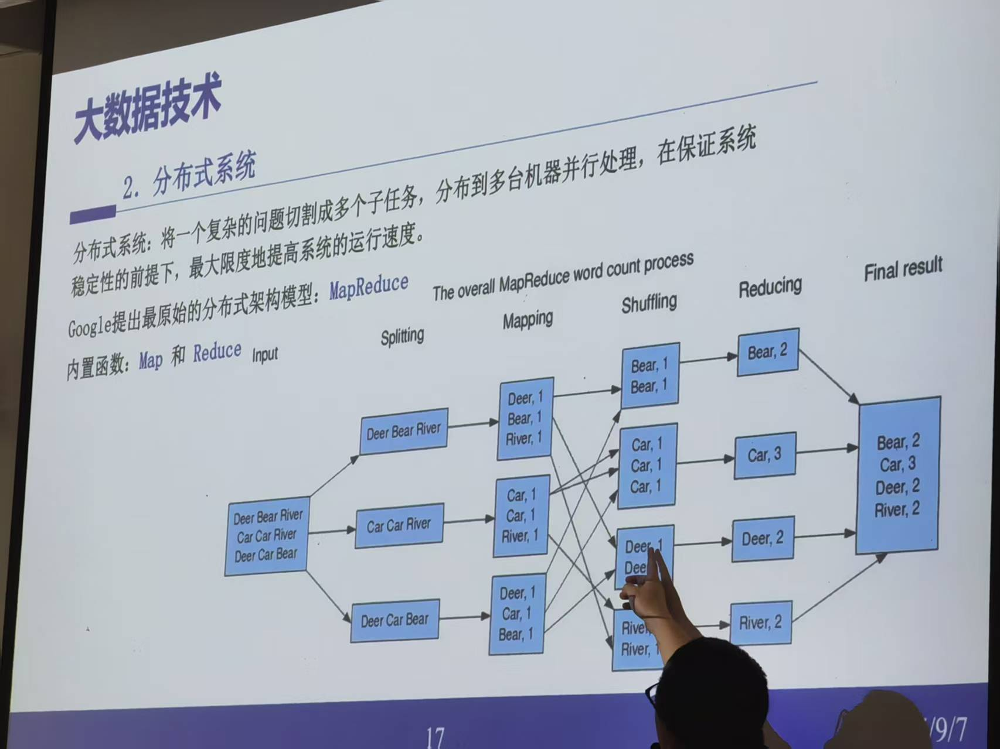
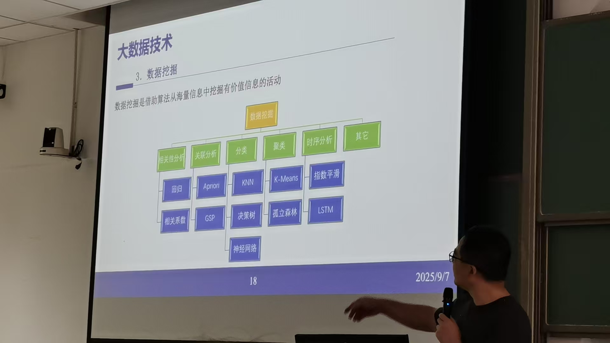
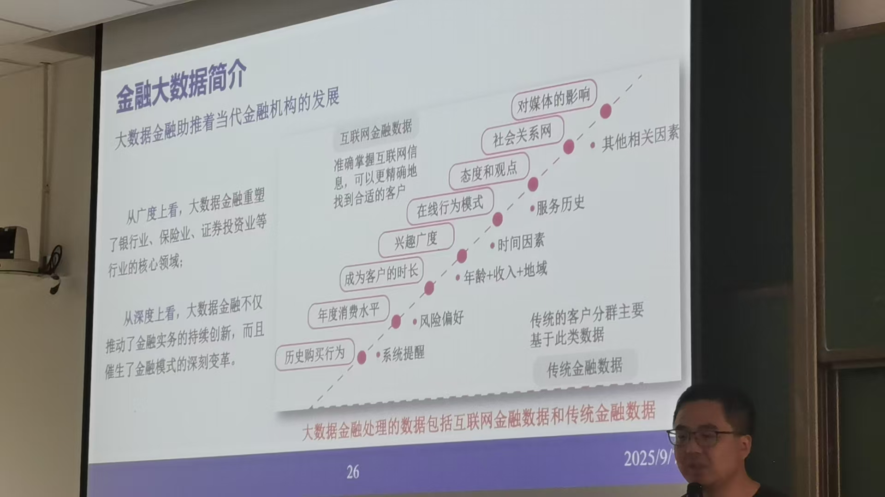
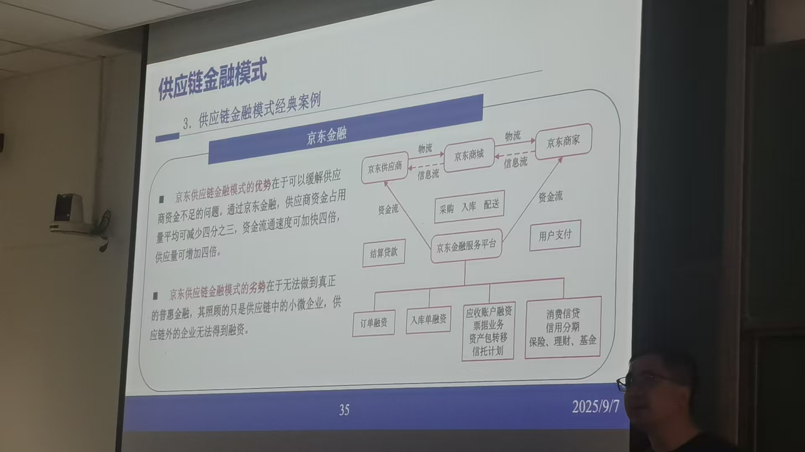

# 课程-大数据决策分析与决策
> 2025年9月7日 第一节课  
>  大数据分析和决策  
>  助教： 
>  陈涛
>   
> 本课能学到
> - 了解金融大数据的基本概念和相关理论知识    
> - 1、金融大数据知识简介      
> - 2、金融大数据理论基础
> - 3、python基础
> - 4、金融场景下的python
> - 5、python金融分析
> - 6、深度学习大数据分析
> - 7、经典案例分析和实践
> 要求： 不考试   
> 考勤、课堂表现(讨论和发言) 10%    
> 作业 20     
> 课程报告 70%
>   

## 第一次课
2025年9月7日   
### 大数据背景简介  

大数据特点：   
1、体量巨大。2025年，全球年新增数据量达到175ZB       
2、数据类型。多样化和非机构化   
3、处理速度快。从复杂数据中获取高价值信息。   
4、价值密度低。   

计算方式：         
1、云计算  
2、分布式系统（核心map和reduce）   
   

3、数据挖掘   
借助算法从海量信息中挖掘有价值信息活动   
   

大数据挑战:   
1、网络架构    

2、数据中心     
为啥大数据在贵州等中西部地区？       
地皮便宜、电费便宜      
数据丢失   
数据安全  

3、运维的挑战     

### 金融大数据简介 
金融行业是典型的数据驱动行业，每天产生大量数据，包括交易、报价、业绩报告等各种指标数据     

金融数据产生主题： 人、物、机器

## 第二次课 

## 第三次课
