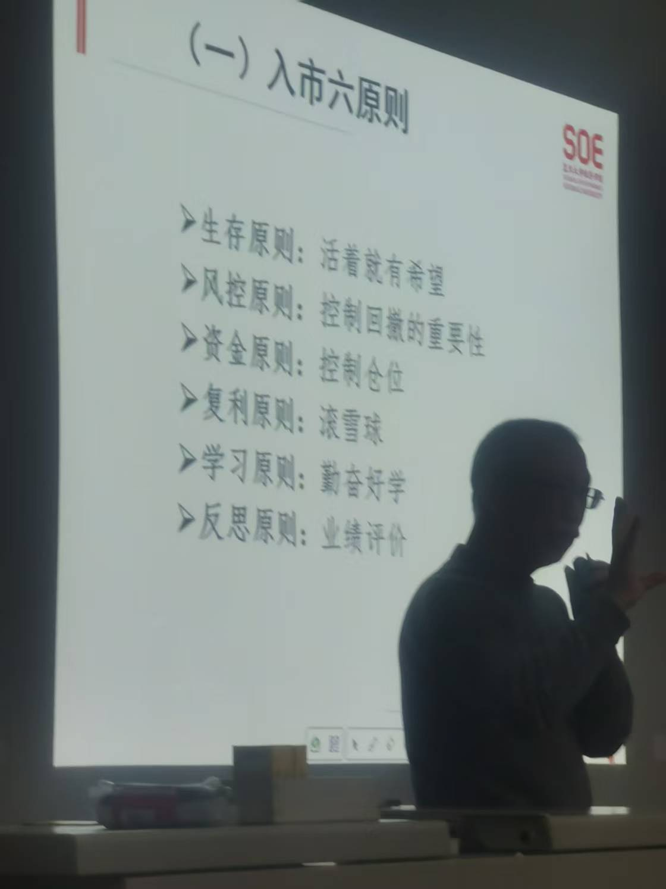

# 课程-企业投融资 
> 2025年2月16日 第一节课  
>  罗忠洲   
>  参考书：《投资银行学》， 《证券投资分析》罗老师自己编写的
>   
> 本课能学到
>  
> 要求：   
> 到课率和模拟投资 30%；  要求：只能开一个账户，最少买卖2次   
> 写论文要写3K文字(不能抄，会查重 重复率不超过10%)  70%；  要求：所学投资心得    
> 上课时间:   
> 15:40 -> 18:40
> 

## 第一次课
证券基金和债券投资

> **ST股票一律不要碰**   
> ST股票是指在中国A股市场中，由于财务状况或其他异常情况，被上海证券交易所或深圳证券交易所实施特别处理（Special Treatment, 简称ST）
> 的上市公司的股票。这些特殊情况通常包括但不限于连续两年亏损、每股净资产低于股票面值、财务报告存在重大问题、公司生产经营活动受到严重影
> 响等。 一旦某只股票被标记为ST，这意味着该公司处于一种风险警示状态，旨在提醒投资者注意投资风险。ST股票的交易有一些特殊的规则：  
> 股票报价的日涨跌幅限制为5%，而不是普通股票的10%。
> 股票名称前会加上“ST”标识，以区别于其他非ST股票。
> 上市公司的中期报告必须经过审计。
> 此外，如果一家公司的财务状况进一步恶化，例如连续三年亏损，则该公司的股票会被标记为*ST，这表示退市预警。这类股票面临更大的退市风险，
> 除非公司能够在规定的时间内改善其财务状况。
> 投资者在考虑投资ST股票时应格外谨慎，并进行充分的研究和分析。虽然一些ST股票可能因为重组等原因而具有潜在的投资价值，但总体来说，
> 它们的风险较高。

> **入市原则**   

## 第二次课
> 2025年2月23日 15:40 -> 18:40  
股票前十年不能玩杠杆 #罗老师名言，10年一周期-经历一轮牛市和熊市，人性等因素影响挺大  
牛市也许快来了，在于赚到钱拿到手 （人的心态很难快速抽离，可以将钱购置其他稳定投资，例如：牛市从未上涨多的，银行类股票；或者抽离）  
利好出尽是利空（不是绝对的，大概率成立）  
利空出尽不一定是利好，特别是熊市 

## 第三次课
> 2025年3月2日 15:51 -> 18:40
技术分析   
技术分析是通过对证券过去走势分析来研判其未来走势(不一定一定有效)   
技术分析是建立道氏理论的三个假设之上的   
道氏理论三大假设： 历史会不断重演； 市场价格反映一切信息； 价格会沿着趋势运动。  

