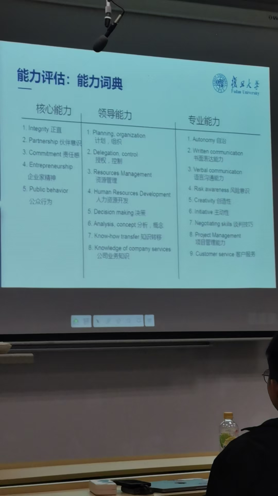

# 课程-人力资源管理 
> 2025年4月13日 第一节课  
> 考核：    
> 课堂考勤和讨论(25%) 签到+课堂讨论(刷脸)    
> 小组案例(35%)  要求详细见下图   
> 期末论文(40%) 论文 每人一份 3k-5k字    
> 

## 第一次课 
人力资源:   
人力(人口中具有劳动能力的人，也称为劳动力，国际惯例劳动年龄人口16-65岁).       
资源(生产资料或生活资料等的来源；为了创造物质财物而投入的生产过程一切要素；包括自然资源，经济资源和人力资源等)。（熊彼特：土地、劳动、资本、企业家精神；
现代社会还包括：信息、数据等）    

在彼得·德鲁克（Peter Drucker）1954年出版的《管理的实践》(The Practice of Management)一书中，他并没有直接给出一个明确的人力资源定义，但他对人力资源管理提出了具有开创性的见解。德鲁克强调了员工在组织中的重要性，并提倡将员工视为一种资产而非成本。他的观点和理论奠定了现代人力资源管理的基础。
在《管理的实践》中，德鲁克提出了一些关于人力资源的关键概念：
- **人力资本**：德鲁克强调了知识工作者的重要性，指出这些人是企业最有价值的资产之一，对于企业的成功至关重要。
- **目标管理(MBO)**：德鲁克提倡管理者与员工共同设定目标，并通过这些目标来指导员工的工作和发展。这种方法不仅提高了工作效率，还促进了员工的职业发展和个人成长。
- **自我控制的信息反馈**：德鲁克建议建立系统让员工能够获得关于他们工作表现的反馈，以便进行自我调整和改进。这种做法有助于增强员工的责任感和参与感。
- **领导力发展**：他认为有效的领导者需要理解并激发员工的最佳能力，这涉及到识别员工的优势和弱点，并为他们提供适合其发展的环境和机会。
虽然德鲁克没有在《管理的实践》中直接定义“人力资源”，但他的工作改变了人们对组织内人员的看法，推动了从传统的、以事务为中心的人事管理向更注重战略性和人性化的现代人力资源管理的转变。德鲁克的工作表明，有效地管理和激励员工是实现组织目标的关键因素。因此，《管理的实践》中关于人力资源的理念主要是围绕如何更好地认识、开发和利用组织成员的能力，以促进个人和组织的成功。

人力资源难点：  
1. 高端招聘不来     
2. 激发潜能(团队，人员)   
一般萝卜 + 大棒   

## 第二次课
功能定位   

## 第四次课
2025年5月18日
薪酬管理  
薪酬是链接员工与组织之间的重要关系，是推动战略落地、激活个体活力、构建公平环境的核心机制。   

### 薪酬重要性
1.  支持组织战略落地
2. 驱动员工行为与绩效

导致离职最关键的因素是：
1. 薪资

津贴和补贴的区别
1. 津贴：和付出相关
2. 补贴：和生活有关，例如，误餐补贴（耽误吃饭）

### 什么是薪酬管理
1. 薪酬管理是组织对员工进行薪酬福利的合理管理，包括薪酬福利的制定、发放、评估、调整、管理、监控和评估。 （总结：来源+分配）
2. 薪酬本质   
2.1  不是发钱，而是分配  
2.2  不仅是钱、更是员工行为“指挥棒”   
2.3  薪酬不是万能的，但薪酬问题毁掉一切  

### 薪酬最关注
1. 工资低于市场水平        体现是公司竞争力(外部)          
关键：性价比的游戏-我的工资配不上我的价值 解药，薪酬调研报告，用3p模型中的position精准对位市场
2. 同事间薪酬不透明引发猜想      体现内部(内部公平性)  
揭示矛盾，内部公平性危机   一般规则公开，薪资不公开，用规则弥补猜忌
3. 绩效奖金不透明   揭露矛盾：激励有效性不足   
好的奖金公式要像GPS-指明方向、又不能让人弯道超车  
4. 福利缺乏吸引力   

课堂问题： 如何管理团队？   

福利吸引力 = 感知价值 / 获得成本 * 社交货币系数    
- **感知价值**：员工对福利实际效用的主观评价，体现其认为从福利中获得的实际收益。  
- **获得成本**：员工为获得该项福利所需付出的代价（如税费、时间、努力等）。  
- **社交货币系数**：能否成为员工炫耀资本。  

诊断薪酬问题的方法
薪酬调研

### 组织的薪酬策略

### 3P人力资源管理模型
什么是3P人力资源管理模型？

3P模型是人力资源管理中常用的系统框架，包含三个核心要素：

1. **岗位（Position）** (`position`)
    - 通过岗位分析明确每个职位的职责、能力要求和绩效标准，确保人岗匹配。

2. **绩效（Performance）** (`performance`)
    - 建立科学的绩效评估体系，激励员工提升工作表现，并与薪酬和发展机会挂钩。

3. **薪酬（Pay）** (`pay`)
    - 设计公平且有竞争力的薪酬结构，体现员工价值并激发积极性。

这三者之间相互关联，形成闭环：岗位决定绩效标准，绩效影响薪酬分配，薪酬又反过来影响员工对岗位的投入与绩效产出。  
该模型常用于构建企业的人力资源管理体系，实现战略目标与员工发展的统一。

### 薪酬设计: 岗位评估方法(岗位付薪酬)

IPE岗位评估方法  

总结：薪酬体系如何处理？  
确定公司定位 （引领还是追随）  
岗位评估   

### 能力付薪酬

能力分类   

### 绩效付薪酬
司机是关键岗位吗？ 能拿高薪吗？    
能力强一定要拿高薪吗？   
同样岗位，同样的能力、谁做得好，贡献大、谁就应该拿高薪    

问题：刚刚毕业名校就是比老员工工资高？工资倒挂如何处理？              
没有明确答复，只是说常见操作，画饼、暴力让老员工抱怨   

企业绩效   
组织绩效 一般重点人员采用这个       
个人绩效 一般底层员工    

年初出绩效目标  年中  年底考核

采用 smart法则

