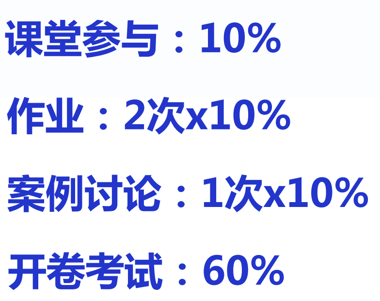
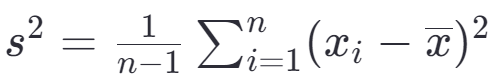

# 课程-项目质量和风险管理 
> 2025年4月13日 第一节课  
>   
>  

## 第一次课

  
## 第二次课
2025年4月20日   

### 质量度量 

#### 样本方差
样本方差是用来衡量一组数据分散程度的一个统计量。样本方差的计算公式为：

\[ s^2 = \frac{1}{n-1} \sum_{i=1}^{n} (x_i - \overline{x})^2 \]

这里：
- \(s^2\) 表示样本方差；
- \(n\) 是样本中的观测值数量；
- \(x_i\) 表示第 \(i\) 个观测值；
- \(\overline{x}\) 表示样本均值，即所有观测值的平均数，\(\overline{x} = \frac{1}{n} \sum_{i=1}^{n} x_i\)；
- \(\sum_{i=1}^{n} (x_i - \overline{x})^2\) 表示对每个观测值减去样本均值后的结果平方求和。

使用 \(n-1\) 而不是 \(n\) 来进行除法的原因是为了让样本方差成为总体方差的无偏估计量。这种方法考虑到了样本均值 \(\overline{x}\) 已经是基于同一
组数据计算出来的事实，从而在计算样本方差时引入了一定程度的偏差。通过除以 \(n-1\) 而不是 \(n\)，可以得到一个更准确的、关于总体方差的估计。

#### 误差
随机误差和系统误差是测量过程中产生的两种主要类型的误差，它们对实验结果的影响方式不同，因此了解这两者的区别以及如何处理它们对于提高测量的准确性和精确度至关重要。

##### 随机误差

- **定义**：随机误差是由不可预测的因素引起的测量值与真实值之间的偏差。这些因素可能是环境变化、仪器的小幅波动或操作中的细微差异等。
- **特点**：
    - 无规律性：随机误差没有固定的方向或模式，时而为正，时而为负。
    - 不可预测性：由于其来源复杂且多变，难以准确预测。
    - 可减小性：通过增加测量次数并计算平均值可以减少随机误差的影响。
- **处理方法**：多次重复测量取平均值、使用统计方法（如标准差、置信区间）评估数据分散程度。

##### 系统误差

- **定义**：系统误差是由某些恒定或按照一定规律变化的因素导致的测量值持续地偏离真实值的情况。这种误差通常是由于仪器校准不当、测量方法不完善或外部条件
- 的系统性影响等原因造成的。
- **特点**：
    - 固定性或规律性：系统误差通常具有固定的方向和大小，可能导致所有测量值都偏高或偏低。
    - 可预测性和可修正性：一旦识别出系统误差的原因，通常可以通过校正、调整仪器或改进测量方法来消除或减少。
- **处理方法**：仔细检查和校准仪器、采用更精确的测量方法、对照已知标准进行验证、分析可能的误差源并采取措施予以纠正。

##### 总结

随机误差和系统误差分别从不确定性和一致性方面影响测量结果。在实际操作中，理解两者的特点有助于采取合适的策略来改善测量质量。例如，通过多次测量和统计分
析来应对随机误差；通过对设备的精确校准和控制实验条件来减少系统误差。同时处理好这两种误差类型，能够有效提升实验数据的可靠性和准确性。

#### 分布
泊松分布、二项式分布和正态分布是三种重要的概率分布，它们在不同的场景下有着各自的应用。下面分别介绍这三种分布，并讨论它们之间的关系。

##### 泊松分布

- **定义**：泊松分布是一种离散概率分布，用于描述在固定时间或空间间隔内某事件发生的次数。它适用于那些事件发生是独立的，并且在一个给定区间内发生的概率是恒定的情况。
- **参数**：λ（lambda），表示单位时间或空间内事件的平均发生率。
- **适用场景**：例如，一天内到达银行的顾客数量、特定时间段内网站的访问量等。
- **特性**：期望值和方差都等于λ。

##### 二项式分布

- **定义**：二项式分布也是一种离散概率分布，描述的是n次独立的伯努利试验中成功次数的概率分布。每次试验只有两种可能的结果：“成功”或“失败”，成功的概率为p，失败的概率为1-p。
- **参数**：n（试验次数）和p（每次试验成功的概率）。
- **适用场景**：例如，在20次投硬币实验中正面出现的次数。
- **特性**：期望值为np，方差为np(1-p)。

##### 正态分布

- **定义**：正态分布是一种连续概率分布，也称为高斯分布。它是自然界和社会科学中许多现象的模型。
- **参数**：μ（mu，均值）和σ²（sigma squared，方差）。
- **适用场景**：如人的身高、测量误差等。
- **特性**：图形是对称的钟形曲线，完全由其均值和标准差决定。

##### 关系

- **泊松分布与二项式分布的关系**：当二项式分布中的试验次数n很大，而单次试验成功的概率p很小，且np保持常数时，二项式分布可以近似为参数为λ=np的泊松分布。这是因为在这种情况下，泊松分布提供了一个更简便的计算方式。

- **泊松分布与正态分布的关系**：当泊松分布的参数λ较大时（通常认为λ>20即可视为较大），泊松分布可以用均值和方差均为λ的正态分布来近似。这是由于中心极限定理的作用，即大量独立随机变量的和趋向于服从正态分布。

- **二项式分布与正态分布的关系**：当n足够大且np和n(1-p)都不太小时，二项式分布可以用正态分布来近似，其中正态分布的均值为np，方差为np(1-p)。这也是基于中心极限定理的应用。

综上所述，这三种分布在特定条件下可以相互近似，理解它们之间的关系有助于根据具体情况选择合适的分布模型进行数据分析和预测。

## 第四次课
2025年5月18日 

过程能力（Process Capability）是指一个生产过程在稳定状态下，能够生产出符合规格要求的产品的能力。它通过比较自然过程变异的范围与工程规格限进行衡量。过程能力分析是质量管理中的一项重要工具，用于评估生产过程的一致性和潜在的缺陷率。

### 关键概念

- **规格限**：由设计或客户要求确定的最大值和最小值，也称为公差限。
- **中心线**：过程平均值或目标值。
- **控制限**：基于过程自然变异计算得出，通常用以监控过程是否处于统计控制状态。
- **短期能力和长期能力**：短期能力（Cp、Cpk）反映了过程在较短时间内，在不考虑过程均值漂移的情况下能达到的最佳性能；长期能力（Pp、Ppk）则考虑了过程中可能发生的各种变化，如机器磨损、原材料变动等，更能反映实际情况。

### 常见指标

1. **Cp（Process Capability Ratio）**：仅考虑规格限宽度与过程分布宽度的关系，没有考虑过程偏移，公式为 \(Cp = \frac{USL - LSL}{6\sigma}\)，其中 USL 和 LSL 分别是规格上限和下限，\(\sigma\) 是过程标准差。

2. **Cpk（Process Capability Index）**：同时考虑了规格限和过程均值的位置关系，用来衡量过程中心度，其计算公式根据过程均值靠近哪一边规格限有所不同，最通用的形式是 \(Cpk = \min\left(\frac{USL-\mu}{3\sigma}, \frac{\mu-LSL}{3\sigma}\right)\)。

3. **Pp 和 Ppk**：类似于 Cp 和 Cpk，但使用的是长期数据估计的标准差，因此它们更能反映出实际生产中的过程能力。

提高过程能力通常需要减少过程变差以及/或者调整过程均值使其更接近于规格中心。这可以通过改进设备精度、优化工艺参数、加强员工培训等多种方式实现。  

