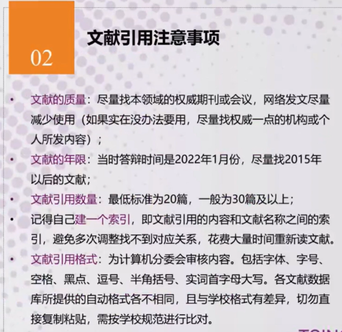

# 论文-一

论文写作注意事项
<BiliBili bvid="BV1Dg4y127qU"/>

## 文献
如何查阅
### 1.0
现有论文论文大概方向(论文主题)，查阅相关论文，工具（主要是知网），找到一篇论文与自己想写主题或者逻辑相近的，作为参考标尺。

### 1.0
反复阅读此篇论文，查看关键观点，概念等引用的文献，根据其所引用的文献查找相关文献；

### 1.0
找到原文，阅读原文，并分析和自己方法和工作差距，用自己语言表达出来。

::: center

倚冬兀自静坐，

♢

♢

♢

:::
