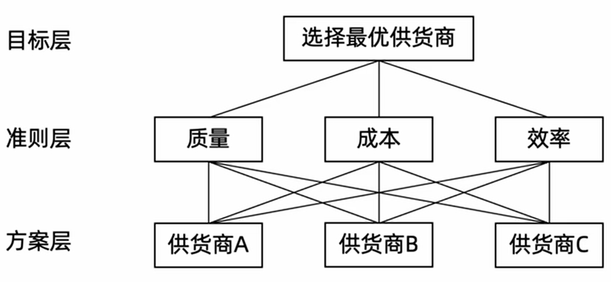
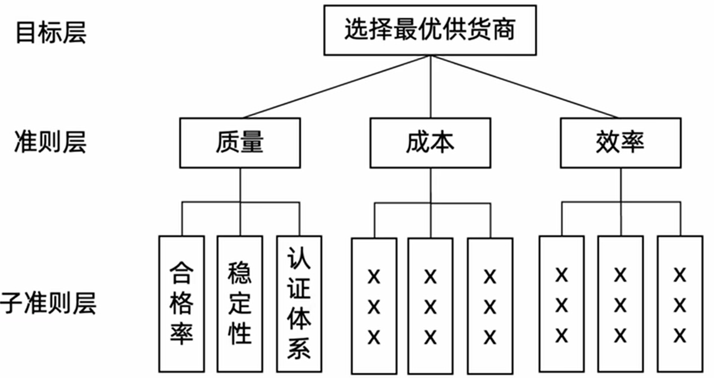
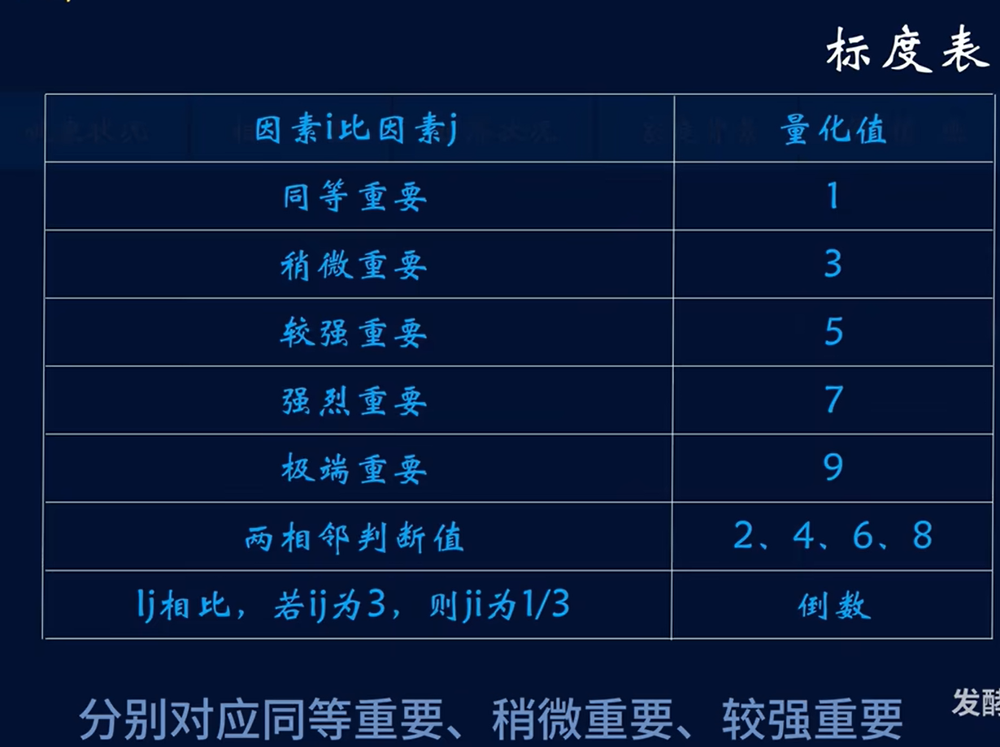
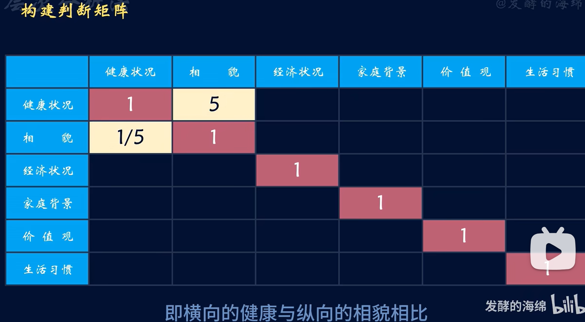
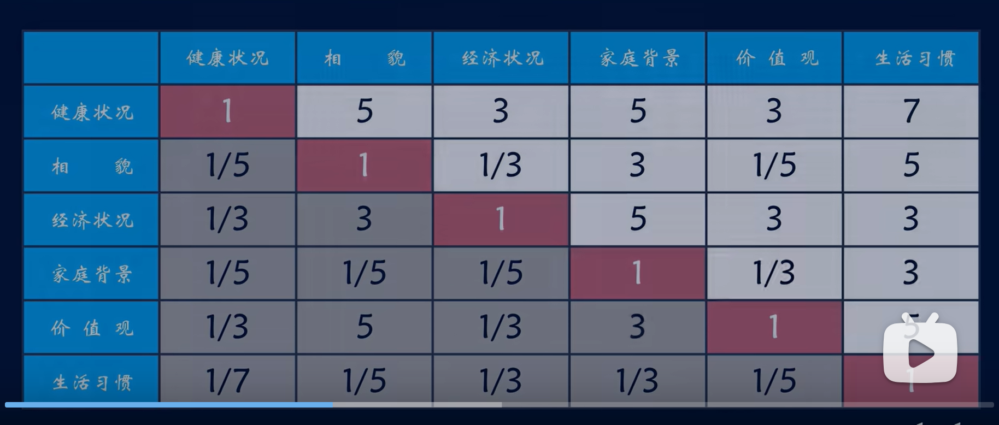
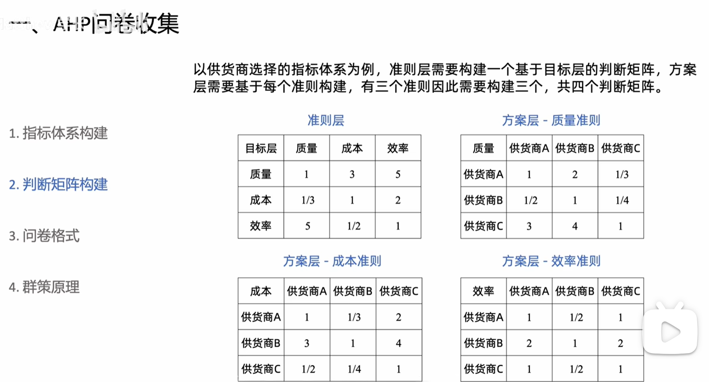
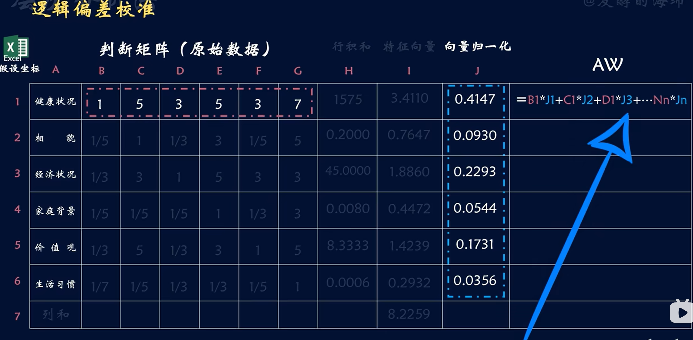
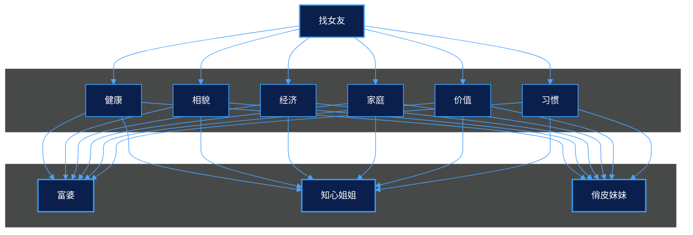

# 论文-质量管理-基本概念

## AHP
AHP是美国运筹学家萨蒂提出来的。将多目标决策看成一个系统。选择困难症的福音。         

学习视频:   
https://www.bilibili.com/video/BV1P7CtBoEB5?spm_id_from=333.788.recommend_more_video.3&trackid=web_related_0.router-related-2589621-ftmm5.1783215280780.768&vd_source=4755df92d584f2e38c7c920e0f533352

https://www.bilibili.com/video/BV1uz421r7gM?buvid=XU05B800F0635C1015F994E2E5CB2A2C92B6E&from_spmid=search.search-result.0.0&is_story_h5=false&mid=uUznQecb7LY3M%2B4oKVUq3Q%3D%3D&plat_id=114&share_from=ugc&share_medium=android&share_plat=android&share_session_id=5eb3fd5f-8fb8-4f86-8711-d8bc94961a72&share_source=WEIXIN&share_tag=s_i&spmid=united.player-video-detail.0.0&timestamp=1783238107&unique_k=MXa0Zgh&up_id=3546594160937520&vd_source=4755df92d584f2e38c7c920e0f533352

对于研究中的复杂决策问题，第一步不是直接打分，而是先构建指标体系，明确目标层、准则层和方案层，再通过问卷或专家评分形成判断矩阵。

以“找女朋友”为例，假设需要从 A、B、C 三个女人中选择最优方案，评价标准包括健康、相貌、经济状况、家庭背景、价值观和生活习惯多个维度。此时，AHP 的基本操作可以概括为五步：

1. **构建层次结构**
   - 目标层：要解决的问题(找女朋友)
   - 因素层/准则层(可以是一级指标-二级指标允许多准则)：解决目标问题所需考虑因素(健康-精神疾病遗传病等二级指标、相貌-身高年龄等等二级指标、经济状况-固定资产流动资产等二级指标、家庭背景-普通家庭高干家庭等二级指标等多项指标)
   - 方案层：解决各类问题的方案(例如：谈恋爱的三维候选人，富婆、小姐姐、妹妹)
   
如果因素层会有2-3级甚至更多，那么又可以递归换转换为：目标层和因素层。   

例如1：  

例如2：  

2. **构建判断矩阵**
   - 让专家或业务人员对同一层级中的指标进行两两比较
   - 比较结果反映各指标在目标中的相对重要性
   - 最终形成权重计算所需的判断矩阵
   - 准则层需要构建基于目标层的判断矩阵，方案层需要基于每个准则构建，有三个准则因此要构建3个，共计4个规则矩阵。  

标度表：  

问卷收集：  

3. **指标权重计算**
   - 问卷的核心不是问“你选谁”，而是问“哪个指标更重要”
   - 例如：质量相对成本重要多少，效率相对质量重要多少
   - 通过成对比较获取专家判断，减少直接打分的随意性

4. **逻辑偏差校准**
   - AHP 不依赖单个专家的主观判断
   - 可以汇总多位专家意见，取一致性较高的结果
   - 在论文中，这种方法适合用来处理“质量管理”“供应商选择”“外包团队评价”等多指标综合决策问题

5. **最优方案计算**

## 在论文中的作用

这套方法适合放在论文的测量阶段或评价阶段，用来把模糊的管理问题转成可量化的指标权重。  
在我的论文里，它可以用于：

- 识别采购、外包、测试、工具等维度的重要性
- 为后续熵权法和帕累托分析提供基础
- 帮助回答“为什么这个问题最重要”“为什么先改这个环节”这类答辩问题

### 一句话理解

AHP 的本质是：**先搭结构，再做比较，最后算权重**。  
它特别适合论文里这种“多指标、多主体、难以直接量化”的管理问题。

### AHP 层次结构图

### 图的含义

- **目标层**：要解决什么问题，这里是“找个女朋友”。
- **因素层**：评价时需要考虑哪些维度，这里是“健康状况、相貌、经济状况、家庭背景、价值观、生活习惯”。
- **方案层**：可供选择的对象是什么，这里是“富婆、知心姐姐、俏皮妹妹”。

这张图的作用是把一个模糊的决策问题拆成结构化层级，后续就可以通过问卷比较和矩阵计算，得到各方案的综合权重。

## 六西格玛  

### SPIOC   

