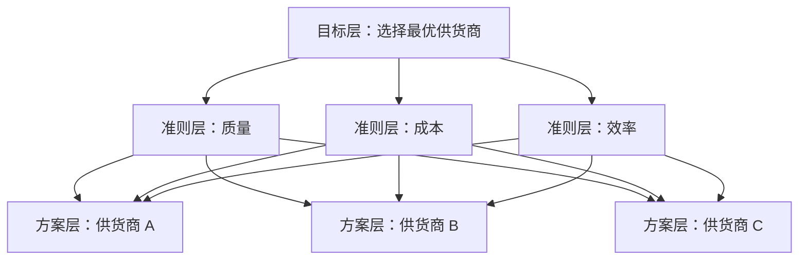

# 论文-质量管理-基本概念

学习视频:   
https://www.bilibili.com/video/BV1P7CtBoEB5?spm_id_from=333.788.recommend_more_video.3&trackid=web_related_0.router-related-2589621-ftmm5.1783215280780.768&vd_source=4755df92d584f2e38c7c920e0f533352

## AHP 问卷收集

对于研究中的复杂决策问题，第一步不是直接打分，而是先构建指标体系，明确目标层、准则层和方案层，再通过问卷或专家评分形成判断矩阵。

以“供应商选择决策”为例，假设需要从 A、B、C 三个供应商中选择最优方案，评价标准包括质量、成本和效率三个维度。此时，AHP 的基本操作可以概括为四步：

1. **指标体系构建**
   - 目标层：选择最优供应商
   - 准则层(一级指标-允许多准则)：质量、成本、效率
   - 方案层(一级指标)：供应商 A、B、C

2. **判断矩阵构建**
   - 让专家或业务人员对同一层级中的指标进行两两比较
   - 比较结果反映各指标在目标中的相对重要性
   - 最终形成权重计算所需的判断矩阵
   - 准则层需要构建基于目标层的判断矩阵，方案层需要基于每个准则构建，有三个准则因此要构建3个，共计4个规则矩阵。  

3. **问卷格式设计**
   - 问卷的核心不是问“你选谁”，而是问“哪个指标更重要”
   - 例如：质量相对成本重要多少，效率相对质量重要多少
   - 通过成对比较获取专家判断，减少直接打分的随意性

4. **群策原则**
   - AHP 不依赖单个专家的主观判断
   - 可以汇总多位专家意见，取一致性较高的结果
   - 在论文中，这种方法适合用来处理“质量管理”“供应商选择”“外包团队评价”等多指标综合决策问题

## 在论文中的作用

这套方法适合放在论文的测量阶段或评价阶段，用来把模糊的管理问题转成可量化的指标权重。  
在我的论文里，它可以用于：

- 识别采购、外包、测试、工具等维度的重要性
- 为后续熵权法和帕累托分析提供基础
- 帮助回答“为什么这个问题最重要”“为什么先改这个环节”这类答辩问题

## 一句话理解

AHP 的本质是：**先搭结构，再做比较，最后算权重**。  
它特别适合论文里这种“多指标、多主体、难以直接量化”的管理问题。

## AHP 层级结构图

### 图的含义

- **目标层**：要解决什么问题，这里是“选择最优供货商”。
- **准则层**：评价标准是什么，这里是“质量、成本、效率”。
- **方案层**：可供选择的对象是什么，这里是“供货商 A、B、C”。

这张图的作用是把一个模糊的决策问题拆成结构化层级，后续就可以通过问卷比较和矩阵计算，得到各方案的综合权重。

